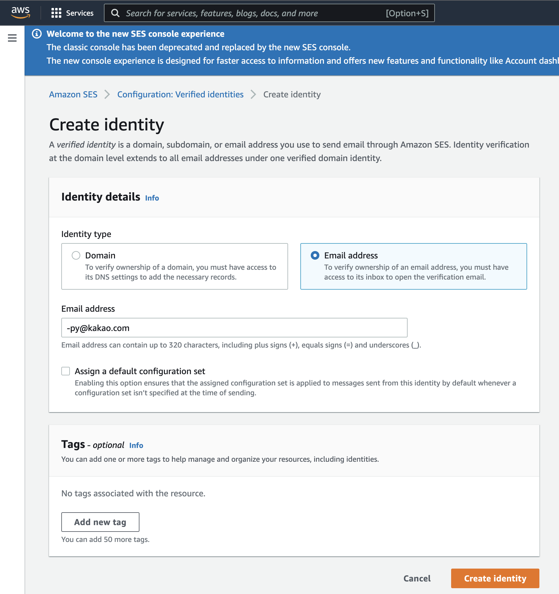

- [개요](#개요)
- [왜 SES 인가요?](#왜-ses-인가요)
- [SES 사전 구성하기](#ses-사전-구성하기)
  - [from 도메인 설정하기](#from-도메인-설정하기)
  - [메일 전송 테스트하기](#메일-전송-테스트하기)
  - [ses 운영 모드로 변경하기](#ses-운영-모드로-변경하기)
- [이메일 인증 구현하기](#이메일-인증-구현하기)
  - [1. 인증 코드 생성](#1-인증-코드-생성)
  - [2. 인증 코드 저장](#2-인증-코드-저장)
  - [3. 인증 코드 발송](#3-인증-코드-발송)
  - [4. 인증 코드 확인](#4-인증-코드-확인)
- [마무리](#마무리)

## 개요

최근 사이드 프로젝트에서 회원가입용 이메일 인증을 구현할 일이 있어서 SES 로 구현한 경험을 공유합니다.

코드 설명은 `django` 기준으로 작성하였습니다.

## 왜 SES 인가요?

이메일을 발송하기 위한 솔루션들이 여러가지 존재합니다.

가장 원초적인 방법은 smtp 서버를 구축하는것입니다.

하지만 우리는 항상 그랬듯이 시간과 자원이 부족하기 때문에 다른 솔루션을 사용하고 있습니다.

아래는 대표적인 이메일 솔루션 리스트입니다.

- [Amazon SES](https://aws.amazon.com/ses/)
- [SendGrid](https://sendgrid.com/)
- [Mailgun](https://mailgun.com/)
- [Mandrill](https://mandrill.com/)
- [Mailjet](https://mailjet.com/)
- [Sparkpost](https://sparkpost.com/)
- [Postmark](https://postmarkapp.com/)
- [Mailjet](https://mailjet.com/)
- [Sendinblue](https://www.sendinblue.com/)

대부분 python 으로 동적 메일 생성을 지원하고 마우스 클릭으로 쉽게 메일 템플릿을 작성할 수 있도록 도와주는 기능을 포함하고 있지만 모두 매 월 몇만원 정도의 결제를 받고 있습니다.

우리는 간단한 인증코드만 보낼것이므로 매 월 62,000건을 무료로 지원하는 AWS SES 를 사용했습니다.

## SES 사전 구성하기

### from 도메인 설정하기

SES 를 설정하기 위해서는 우선 도메인이 필요합니다.

우선 도메인이 있다고 가정하고, 다음과 같이 from 에 사용할 도메인을 설정합니다.


### 메일 전송 테스트하기

처음 ses 를 구성하면 사전 설정한 이메일로만 전송이 가능한 샌드박스 모드로 설정되어 있습니다.

다음과 같이 전송 테스트할 이메일을 구성합니다.



그 다음 send test 구성을 다음과 같이 입력합니다.

현재는 샌드박스 모드이기 때문에 반드시 설정된 이메일로만 전송할 수 있습니다.


### ses 운영 모드로 변경하기

테스트 전송을 성공적으로 마쳤다면 실제 운영환경에서 사용할 수 있도록 샌드박스 환경을 해제해야합니다.

다음 주소로 접근해서 샌드박스 해제를 요청합니다.

https://us-east-1.console.aws.amazon.com/support/home#/case/create?issueType=service-limit-increase&limitType=service-code-ses

저는 모바일 앱에서 회원가입을 위해 사용하는 케이스여서 사이트가 없었습니다.

최대한 상세하게 요청해야 한번에 해제해 줄 확률이 높습니다.

저는 다음과 같은 내용을 영어로 전송했습니다.

```txt
모바일에서 회원가입을 위해 사용하므로 사이트가 없습니다.
최초 가입 시 1회만 발송되기 때문에 하루 100회 정도 예상됩니다.
이메일 데이터는 회원 DB에 저장됩니다. 우리는 수신자 목록을 저장하지만 그들에게 마케팅하지는 않습니다.

email example:

제목: [허블] 회원가입 이메일 주소 확인 요청드립니다

내용:
안녕하세요, 허블입니다.
회원가입 이메일 주소 확인을 위해 아래 링크를 클릭해주세요.

<a href='{verify_url}'>{verify_url}</a>

만약 회원가입 요청을 보낸적이 없으시다면 이 메일을 무시해주세요.
```

사용 목적, 하루 발송 예상량, 유저 저장 위치 및 마케팅 여부, 이메일 발송 예시 등을 적어주는것이 좋습니다.

요청은 대게 영업일 기준 2일 이내로 완료되는것 같고 저는 하루 50,000개의 할당량을 받았습니다.

## 이메일 인증 구현하기

우리는 이메일 인증을 구현하기 위해서 아래와 같은 절차가 필요합니다.

### 1. 인증 코드 생성

아래와 같이 인증 코드를 생성합니다.

해커가 무차별 대입을 하기 어렵도록 uuid4를 사용하는것도 좋은 방법이지만, UX 를 고려해서 시간제한을 두고 4자리 숫자를 생성하겠습니다.

```python
from random import randint

def generate_code():
    return randint(1000, 9999)
```

### 2. 인증 코드 저장

아래와 같은 모델이 존재한다고 가정하고 인증 코드를 저장합니다.

```python
from django.utils import timezone

def generate_after_30min():
    return timezone.now() + timedelta(minutes=30)

class EmailVerify(models.Model):
    email = models.EmailField()
    sn = models.CharField("sn", max_length=32, default=generate_code)
    is_verified = models.BooleanField(default=False)
    expired_dt = models.DateTimeField(default=generate_after_30min)
  
email_verify = EmailVerify(email=email).save()
print(email_verify.sn)  # 인증코드를 여기서 획득합니다
```

### 3. 인증 코드 발송

아래와 같이 인증 코드를 발송합니다.

```python
import boto3

def send_email(to_email, subject, body_text, body_html):
    client = boto3.client("ses", region_name="ap-northeast-2")
    sender = "<우리가 가진 이메일 주소>"

    try:
        response = client.send_email(
            Destination={
                "ToAddresses": [
                    to_email,
                ],
            },
            Message={
                "Body": {
                    "Html": {
                        "Charset": "UTF-8",
                        "Data": body_html,
                    },
                    "Text": {
                        "Charset": "UTF-8",
                        "Data": body_text,
                    },
                },
                "Subject": {
                    "Charset": "UTF-8",
                    "Data": subject,
                },
            },
            Source=sender,
        )
    except ClientError as e:
        print(e.response["Error"]["Message"])
    else:
        print("Email sent! Message ID:"),
        print(response["MessageId"])

body = f"인증번호를 앱에 입력해주세요.\n인증번호: {email_verify.sn}"
send_email(
    to_email=email_verify.email,
    subject="인증 확인 메일입니다.",
    body_text=body, 
    body_html=body
)
```

> **주의사항**
> email 전송은 매우 오래 걸릴 수도 있는 작업이기 때문에 celery 같은 비동기 큐를 사용해야합니다.
> 그렇지 않으면 api 응답 시간이 매우 길어질 수 있습니다.

### 4. 인증 코드 확인

유저가 메일에 있는 인증 코드를 입력하면 아래와 같이 인증 코드를 확인합니다.

```python
# urls.py
urlpatterns = [
    path("email-verify/<str:sn>", EmailVerifyView.as_view()),
]
```

```python
# views.py
class EmailVerifyView(generics.GenericAPIView):
    permission_classes = (AllowAny,)

    def get(self, request, sn, *args, **kwargs):
        verify = EmailVerify.objects.filter(sn=sn).last()
        if verify and verify.expired_dt > timezone.now():
            verify.is_verified = True
            verify.save()
        else:
            return Response(status=status.HTTP_401_UNAUTHORIZED)
        return Response(status=status.HTTP_204_NO_CONTENT)
```

## 마무리

python 으로 이메일 인증하는 기능을 도입해 보았습니다.

저는 숫자 4자리를 앱에 직접 입력하도록 해놓았지만 편의를 위해 링크를 클릭하기만 해도 인증이 완료되는 방식으로 코드를 작성할 수도 있습니다.

ses 를 이용해서 이메일 인증을 간단하고 저렴하게 도입해보시기 바랍니다.
