- [개요](#개요)
- [경보 설정](#경보-설정)
- [메신저에서 webhook 설정하기](#메신저에서-webhook-설정하기)
  - [메신저에서 webhook 설정하기 (teams)](#메신저에서-webhook-설정하기-teams)
- [메신저에서 webhook 설정하기 (slack)](#메신저에서-webhook-설정하기-slack)
- [업무용 메신저로 데이터 전송하는 lambda 함수 작성](#업무용-메신저로-데이터-전송하는-lambda-함수-작성)
  - [teams 용 lambda 코드](#teams-용-lambda-코드)
  - [slack 용 lambda 코드](#slack-용-lambda-코드)
- [SNS 구독 설정](#sns-구독-설정)
- [메세지 수신](#메세지-수신)
- [마무리](#마무리)

## 개요

서버의 사용자가 많아지면 트래픽에 대한 대비를 해야합니다.

대부분 모니터링을 하지만 사람이 모든 요소를 하나하나 볼 수 없기 때문에 경보 설정을 합니다.

이번 글에서는 aws 리소스에 대한 경보 설정 그리고 업무용 메신저(slack, teams)로 경보를 받는 설정 방법까지 알아보겠습니다.

## 경보 설정

에러 발생 증가, 트래픽 급증가, 서버의 자원 부족 등 경보를 지정해야하는 metric 은 다양합니다.

우리는 api 의 latency 증가에 경보를 설정해보겠습니다.

만약 다른 metric 에 경보를 설정하고 싶으면 필요한 resouce 를 찾아서 지원하는 metric을 설정하기만 하면 됩니다.

다음과 같이 cloud watch 에 `All alarms` 에 접근합니다.

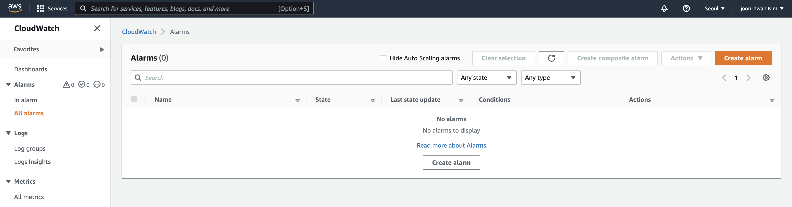

`Create Alarm` 버튼을 누르고 `select metric` 을 누르면 다음과 같이 metric 을 설정할 수 있는 화면이 나옵니다.

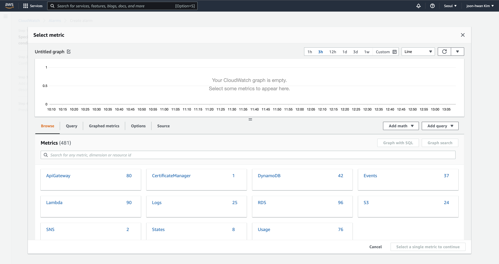

우리는 운영중인 서비스의 api gateway latency 경보를 설정할것이기 때문에 운영중인 서비스의 이름을 검색하고 Latency 항목을 체크해줍니다.

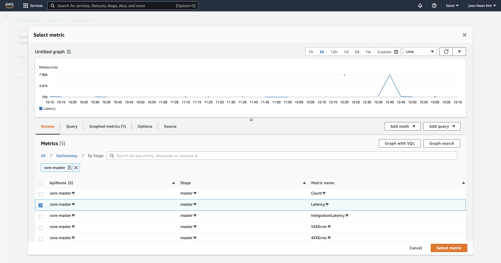

다음으로 넘어가면 지표와 함께 어떤 값으로 경보를 설정할 것인지를 물어봅니다.  
저는 5분간의 평균이 300ms 초과이면 경보를 울리게 설정했습니다.

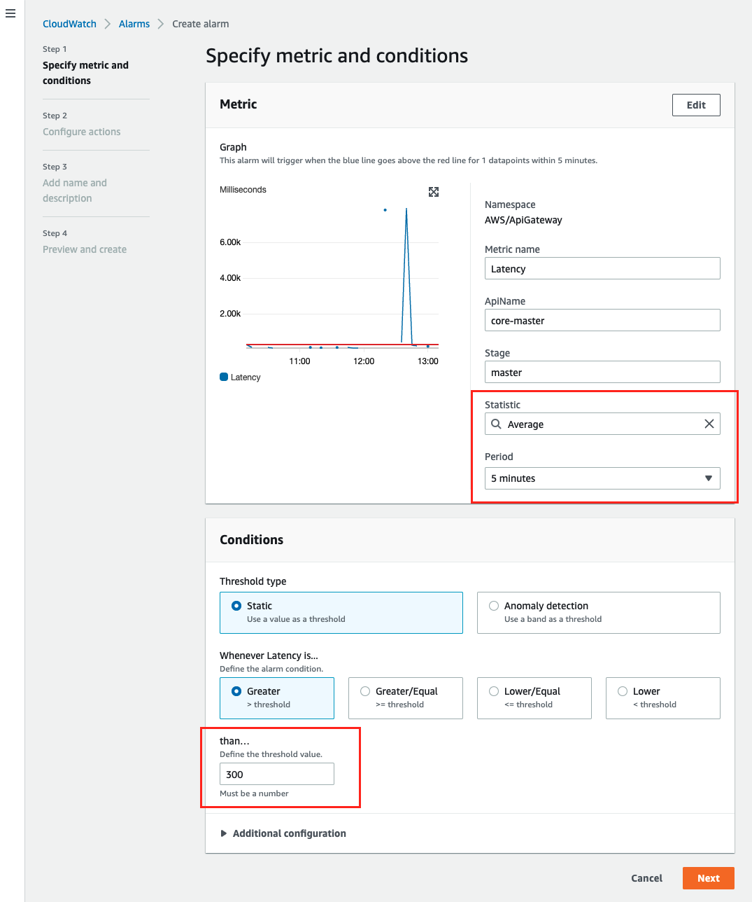

새로운 SNS 토픽을 생성하는 옵션을 선택하고, 적당한 이름을 작성해줍니다. 그리고 email 이 필수이지만 나중에 삭제할 수 있으니 아무 이메일이나 입력해줍니다.

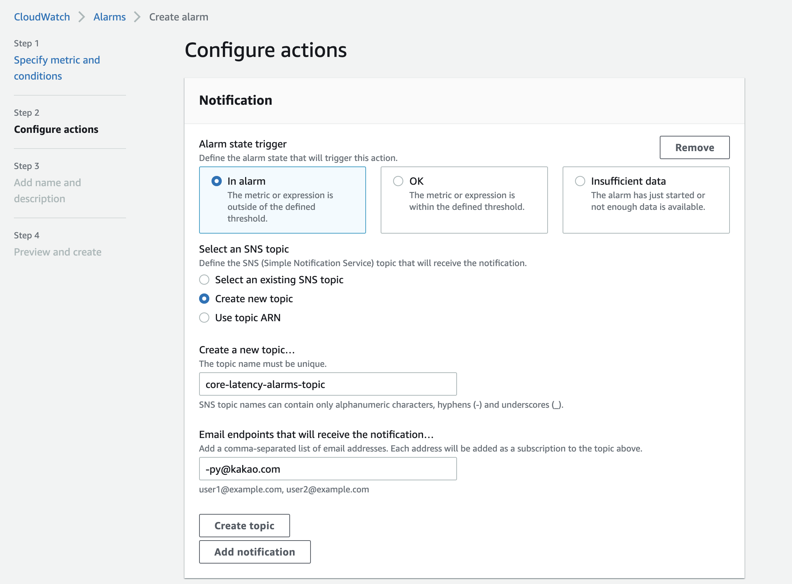

다음으로 넘어가서 경보의 이름을 입력해주면 생성 과정을 마쳤습니다.

이제 amazon SNS 에 접근해서 방금 생성했던 토픽으로 들어가보면 아까 입력했던 email 이 pending confirmation 상태일텐데, 메일함에서 confirm 을 누르고 나면 다음과 같이 삭제할수 있게 됩니다.

저는 메일로 받고 싶지 않아서 삭제했는데 메일로도 받고 싶으신 분들은 그냥 두시면 됩니다.

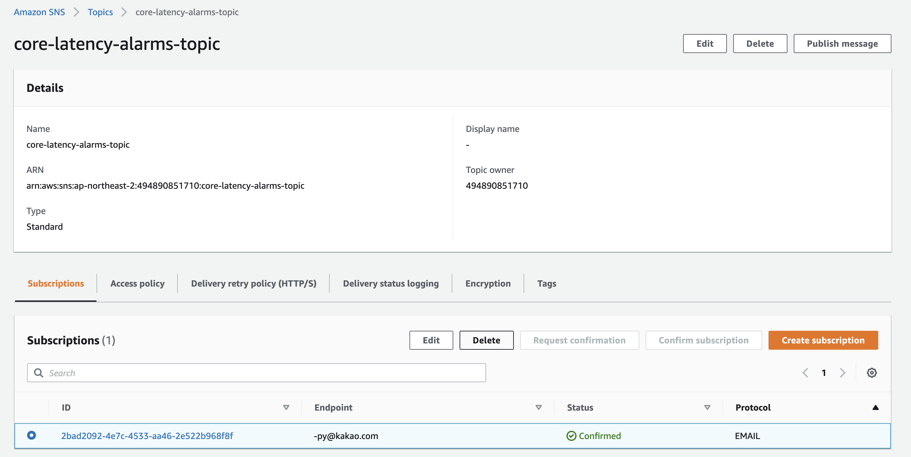

## 메신저에서 webhook 설정하기

메신저에서 경보를 받으려면 우선 메신저에서 메세지를 받을 수 있도록 Incoming webhook 을 설정해야합니다.

### 메신저에서 webhook 설정하기 (teams)

채널 이름 옆 `...` 메뉴로 들어가서 다음과같이 커넥터를 누릅니다.

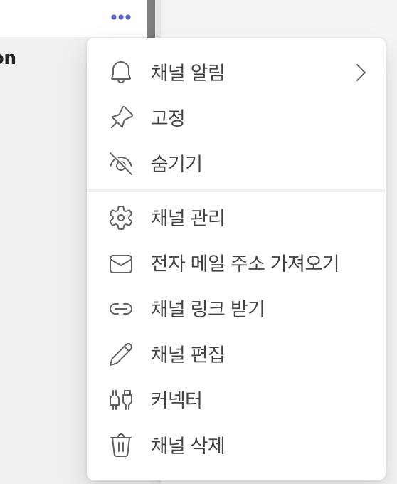

Incoming Webhook 구성을 누릅니다.

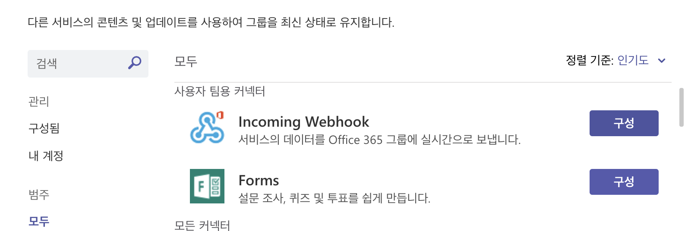

webhook 의 이름과 이미지 설정을 마치고 만들기를 누르면 다음과 같이 url 이 생성되는데 이 url 이 외부를 통해서 메세지를 보낼 수 있는 webhook url 입니다.

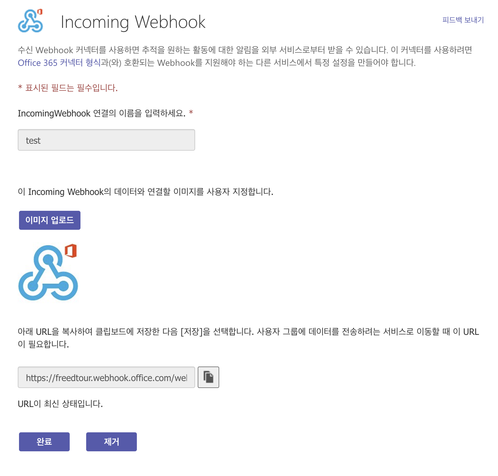

## 메신저에서 webhook 설정하기 (slack)

slack 메신저의 `앱`을 들어가서 webhook 을 검색하면 Incoming WebHooks 가 나오는데, 추가를 누릅니다.

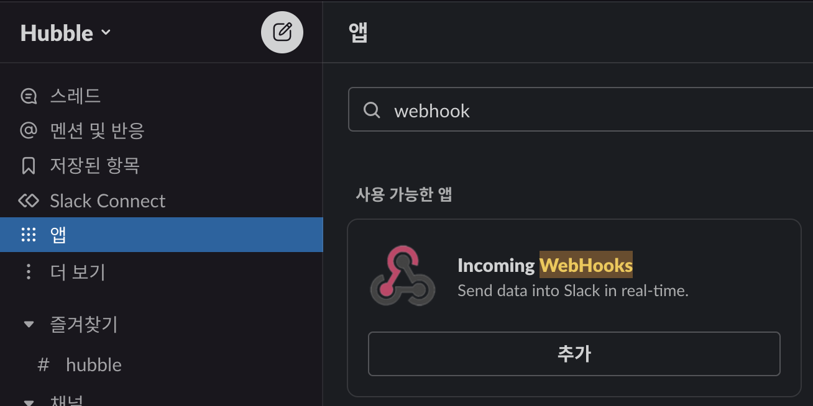

다음과 같은 화면이 나오는데, `slack에 추가`를 누르고

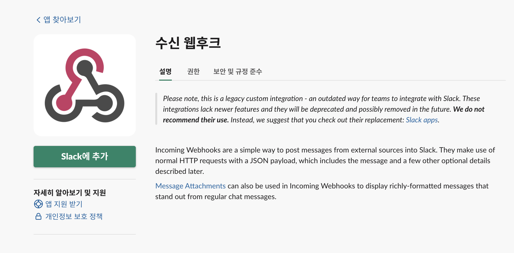

채널을 선택한 뒤 `수신 웹후크 통합 앱 추가`를 누릅니다

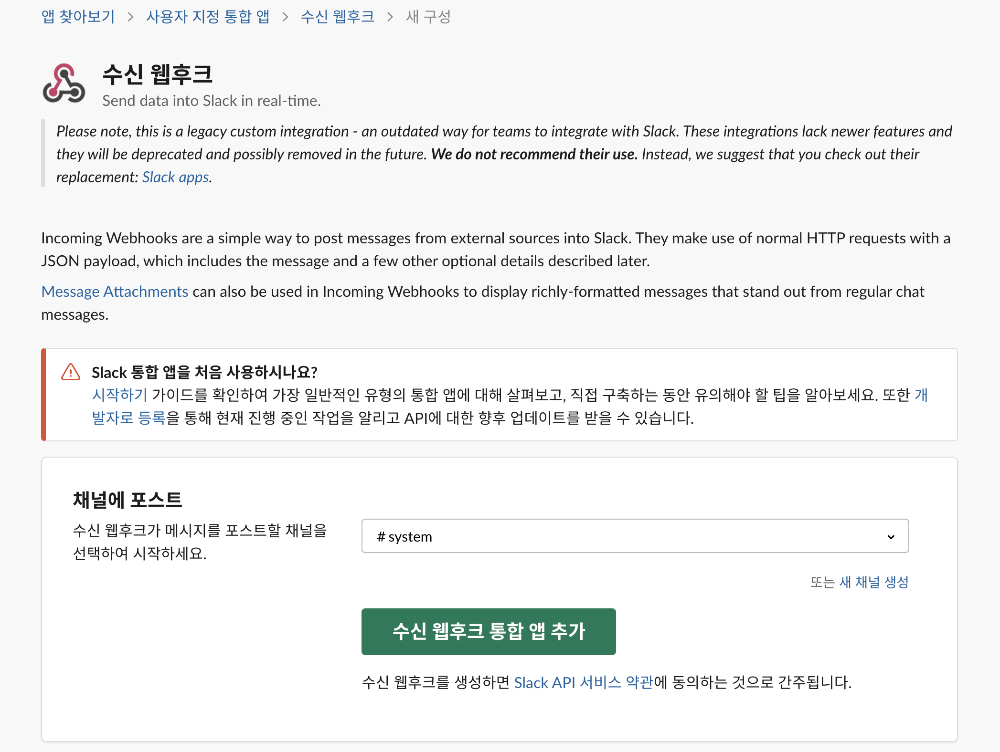

웹후크 URL이 생성되는데 이 url 이 외부를 통해서 메세지를 보낼 수 있는 webhook url 입니다.

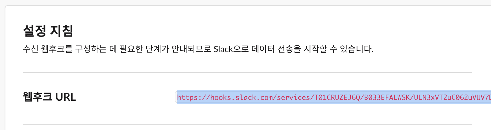

다음 코드로 테스트해볼 수 있습니다.

```sh
curl -X POST --data-urlencode "payload={\"channel\": \"#system\", \"username\": \"webhookbot\", \"text\": \"이 항목은 #개의 system에 포스트되며 webhookbot이라는 봇에서 제공됩니다.\", \"icon_emoji\": \":ghost:\"}" https://hooks.slack.com/services/<webhookurl>
```

다음과 같이 메세지가 채널에 수신됩니다.

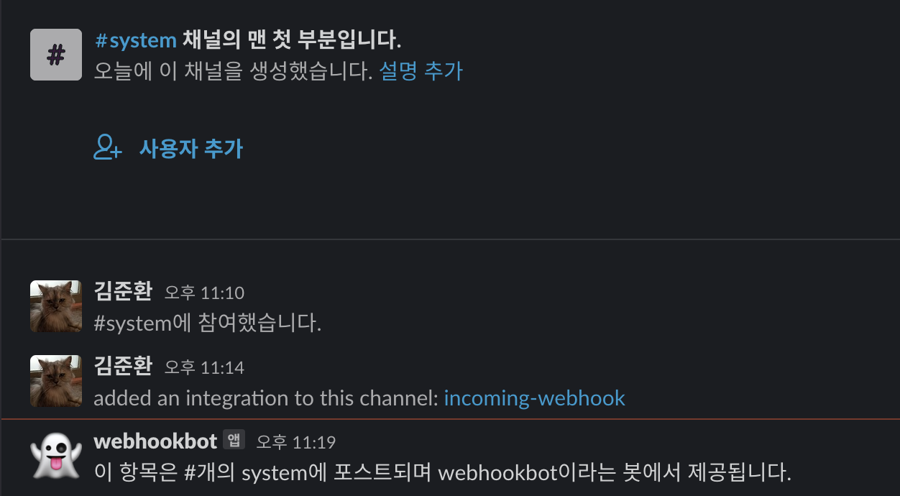

## 업무용 메신저로 데이터 전송하는 lambda 함수 작성

lambda 함수를 생성하고 다음과 같이 코드를 작성합니다.

### teams 용 lambda 코드

```python
#!/usr/bin/python3.9
import urllib3 
import json

http = urllib3.PoolManager() 

def lambda_handler(event, context): 
    url = "https://freedtour.webhook.office.com/webhookb2/xxxxxxx"
    msg = {
        "text": event['Records'][0]['Sns']['Message']
    }
    encoded_msg = json.dumps(msg).encode('utf-8')
    resp = http.request('POST',url, body=encoded_msg)
    print({
        "message": event['Records'][0]['Sns']['Message'], 
        "status_code": resp.status, 
        "response": resp.data
    })
```

### slack 용 lambda 코드

```python
#!/usr/bin/python3.9
import urllib3
import json

http = urllib3.PoolManager()

def lambda_handler(event, context):
    url = "https://hooks.slack.com/services/xxxxxxx"
    msg = {
        "channel": "#CHANNEL_NAME",
        "username": "WEBHOOK_USERNAME",
        "text": event['Records'][0]['Sns']['Message'],
        "icon_emoji": ""
    }
    
    encoded_msg = json.dumps(msg).encode('utf-8')
    resp = http.request('POST',url, body=encoded_msg)
    print({
        "message": event['Records'][0]['Sns']['Message'], 
        "status_code": resp.status, 
        "response": resp.data
    })
```

## SNS 구독 설정

성공적으로 lambda 코드를 작성했다면 처음 생성했던 sns 토픽으로 들어가서 구독을 설정해야합니다.

토픽을 선택하고 `Create subscription` 버튼을 눌러서 다음과 같이 프로토콜을 lambda 로 선택하고 lambda 의 arn 을 입력한뒤 `Create subscription` 버튼을 눌러서 생성해줍니다.

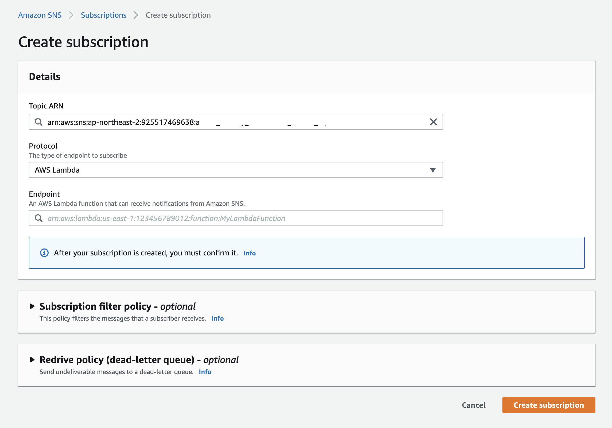

## 메세지 수신

설정된 경보에 트리거되면 다음과 같이 메세지가 전달됩니다.

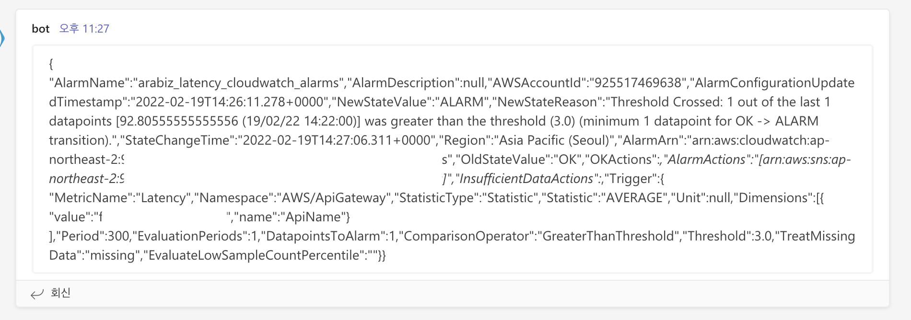

## 마무리

aws 리소스에 대해 경보 설정하는 방법을 알아보았습니다.

경보를 설정하고 끊임없는 모니터링을 통해 트래픽에 대해 빠르고 적절한 대응을 할 수 있도록 준비를 마쳤습니다.

여러분도 본인의 aws 서버에 경보를 설정해보시기 바랍니다!
