# 개요

- 사내 또는 개인적인 프로젝트에서 사용하고 있는 코드 관리하는 방법을 적어보려고 합니다.
- 시행착오를 겪는 중이고 이런 케이스도 있구나 정도로 참고하면 좋을 것 같습니다
- 잘못된 브랜치 전략을 사용하고 있습니다. [이것에 대한 회고](https://pypy.dev/dev/git-flow-%EC%9E%98%EB%AA%BB-%EC%93%B0%EA%B3%A0-%EC%9E%88%EC%97%88%EB%8B%A4-azure-devops-%EC%97%90%EC%84%9C-%EA%B6%8C%EC%9E%A5%ED%95%98%EB%8A%94-%EB%B8%8C%EB%9E%9C%EC%B9%98-%EC%A0%84%EB%9E%B5)
- 전체적인 흐름을 적은 내용이고 구체적인 내용은 링크를 걸어놓았으니 참고해주시면 좋을것 같습니다.
- 사용하는 언어, 프레임워크, 테스트는 `python3`, `django`, `unittest`, `coverage` 입니다.
- 프로젝트 관리는 `azure devops` 를 사용합니다

  > 모든 내용은 결과적으로 실수를 줄이기 위한 과정입니다
  > 처음에는 조금 귀찮지만 프로젝트가 커질수록 퍼포먼스가 증가한다고 믿습니다 👻

# 코드 작성

### 코드 컨벤션 철저하게 지키기 ✨

- [pep8 스타일 가이드](https://www.python.org/dev/peps/pep-0008/)를 준수합니다.
- `[flake8](https://github.com/pycqa/flake8)` 패키지를 이용해 컨벤션 검사를 합니다.

  - 사용중인 파이프라인에서 컨벤션 테스트를 통과한 뒤 코드가 머지될수 있도록 합니다.

    ```yaml
    # 사내 프로젝트에서 사용중인 파이프라인
    - script: |
        pipenv run flake8 --exclude=venv,migrations,apps.py --max-line-length=120
      condition: and(succeeded(), and(not(contains(variables['Build.SourceBranch'], 'refs/heads/release')), not(contains(variables['Build.SourceBranch'], 'refs/heads/hotfix')), ne(variables['Build.SourceBranch'], 'refs/heads/develop')))
      displayName: 'Run lint tests'
    ```

- [`isort`](https://github.com/PyCQA/isort) 패키지를 사용해서 코드를 좀 더 깔끔하게 정리할 수 있습니다.

  - `.isort.cfg` 설정 파일을 다음과 같이 세팅하고 `isort .` 명령을 사용합니다

    ```jsx
    [settings]
    skip=migrations,venv
    virtual_env=./venv
    multi_line_output=4
    line_length=120
    // 서드파티 라이브러리 리스트
    known_third_party=rest_framework,rest_framework_simplejwt,drf_yasg2,django_filters,django_s3_storage,PIL,websocket
    sections=FUTURE,STDLIB,THIRDPARTY,FIRSTPARTY,LOCALFOLDER
    ```

    개발자 성향에 따라서 isort 대신 [black](https://github.com/psf/black) 을 사용하기도 합니다

- bracket 스타일 정하기

  ```python
  # 닫는 괄호를 여는 괄호 첫번째 글자에 맞추는 방법을 추천합니다 (장고 프로젝트 추천)
  result = some_function_that_takes_arguments(
      'a', 'b', 'c',
      'd', 'e', 'f',
  )

  # 아래와 같은 스타일은 pep8 에서 허용은 되지만 가독성이 떨어집니다
  result = some_function_that_takes_arguments(
      'a', 'b', 'c',
      'd', 'e', 'f',
      )
  result = some_function_that_takes_arguments(
      'a', 'b', 'c',
      'd', 'e', 'f',)
  ```

### Type Annotation 활용하기

### Docstring으로 함수 및 클래스 문서화하기

### 테스트코드 작성하기

- 사내 프로젝트에서는 파이썬에 기본 내장되어있는 unittest 를 사용했지만
  대부분은 pytest 를 이용하는듯 합니다 (pytest 는 unittest 코드와 100% 호환된다고 함 반대로는 X)
- 테스트 코드 작성 요령
  - 모든 테스트는 서로 의존성이 없도록 작성합니다 (어떤 순서로 동작하더라도 모두 통과가 가능하도록)
  - 최대한 많은 케이스를 테스트합니다 [테스트 코드는 많으면 많을수록 좋습니다](https://docs.djangoproject.com/en/dev/intro/tutorial05/#when-testing-more-is-better)
    - 엔드포인트, 메서드, 헤더, 시나리오등 어떤 코드를 테스트해야하는지는 여기서 언급하지 않겠습니다
- 테스트 코드를 파이프 라인과 연동하기

  - 사내에서 사용하는 파이프라인

        ```yaml
        - script: |
            pipenv run coverage run --parallel-mode --concurrency=multiprocessing --rcfile=coverage_config manage.py test --parallel
            pipenv run coverage combine
            pipenv run coverage xml
          condition: and(succeeded(), and(not(contains(variables['Build.SourceBranch'], 'refs/heads/hotfix')), ne(variables['Build.SourceBranch'], 'refs/heads/develop')))
          displayName: 'Run tests'
          env:
            AWS_ACCESS_KEY_ID: $(AWS_ACCESS_KEY_ID)
            AWS_SECRET_ACCESS_KEY: $(AWS_SECRET_ACCESS_KEY)
            FLANB_DEBUG: 'True'

        - task: PublishTestResults@2
          condition: succeededOrFailed()
          inputs:
            testResultsFiles: '**/TEST-*.xml'
            testRunTitle: 'Publish test results for Python'
            # 테스트코드가 한개라도 실패하면 파이프라인을 실패시킵니다
            failTaskOnFailedTests: true

        - task: PublishCodeCoverageResults@1
          inputs:
            codeCoverageTool: Cobertura
            summaryFileLocation: '$(System.DefaultWorkingDirectory)/**/coverage.xml'
            # reportDirectory: '$(System.DefaultWorkingDirectory)/**/htmlcov'
            # failIfCoverageEmpty: true
        ```

  - 사내에서 사용하는 coverage 설정파일

```bash
# file name: coverage_config
[run]
omit =
    */apps.py
    */admin.py
    coffee/asgi.py
    coffee/wsgi.py
    venv/*
    */virtualenvs/*
concurrency=multiprocessing

[report]
# Regexes for lines to exclude from consideration
exclude_lines =
    # Have to re-enable the standard pragma
    pragma: no cover

    # Don't complain about missing debug-only code:
    def __repr__
    if self\.debug

    # Don't complain if tests don't hit defensive assertion code:
    raise AssertionError
    raise NotImplementedError

    # Don't complain if non-runnable code isn't run:
    if 0:
    if __name__ == .__main__.:

ignore_errors = True

[html]
directory = coverage_html_report
```

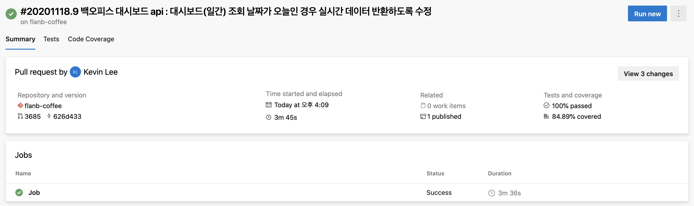

다음과같이 Tests, Code Coverage 탭이 생기고 coverage 에 대한 정보가 대시보드에 표시됩니다

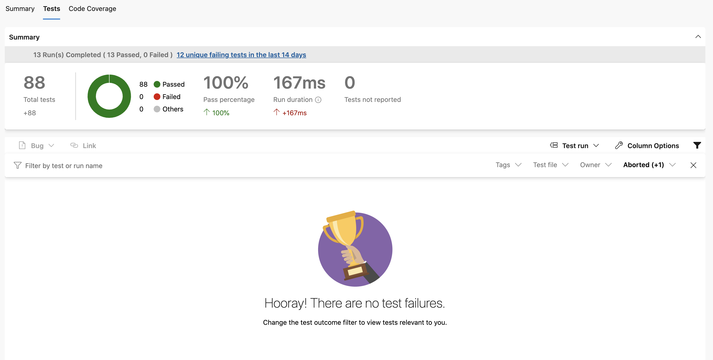

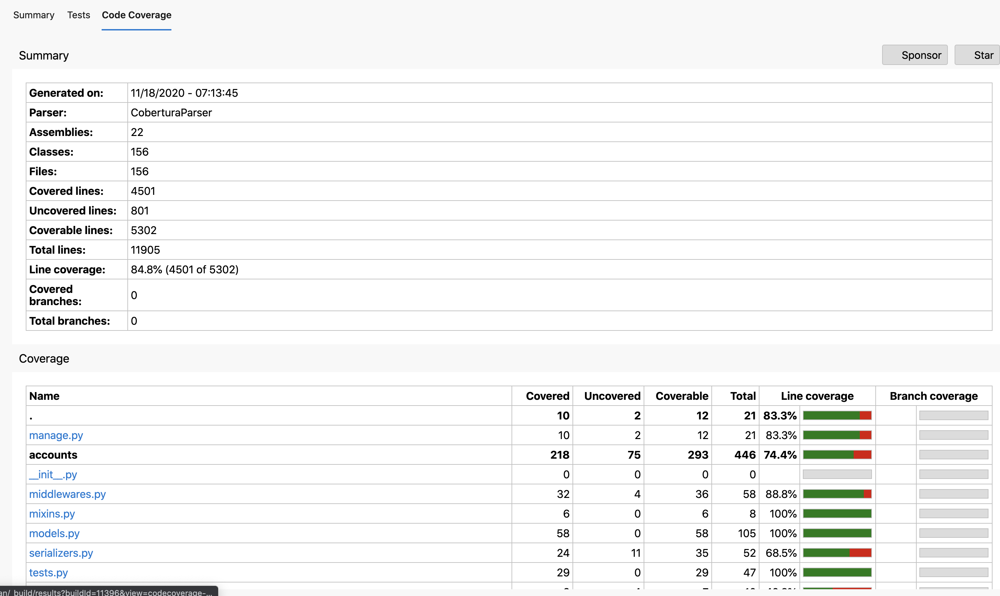

전체 코드중 84.8% 의 코드가 테스트되고 있음을 알수있습니다

# 코드 커밋

### git flow 를 사용했습니다

> git flow 사용하지마세요 [링크](https://pypy.dev/dev/git-flow-%EC%9E%98%EB%AA%BB-%EC%93%B0%EA%B3%A0-%EC%9E%88%EC%97%88%EB%8B%A4-azure-devops-%EC%97%90%EC%84%9C-%EA%B6%8C%EC%9E%A5%ED%95%98%EB%8A%94-%EB%B8%8C%EB%9E%9C%EC%B9%98-%EC%A0%84%EB%9E%B5)

- 머지할때 squash merge 를 사용하면 깃 히스토리가 깔끔하게 관리됩니다

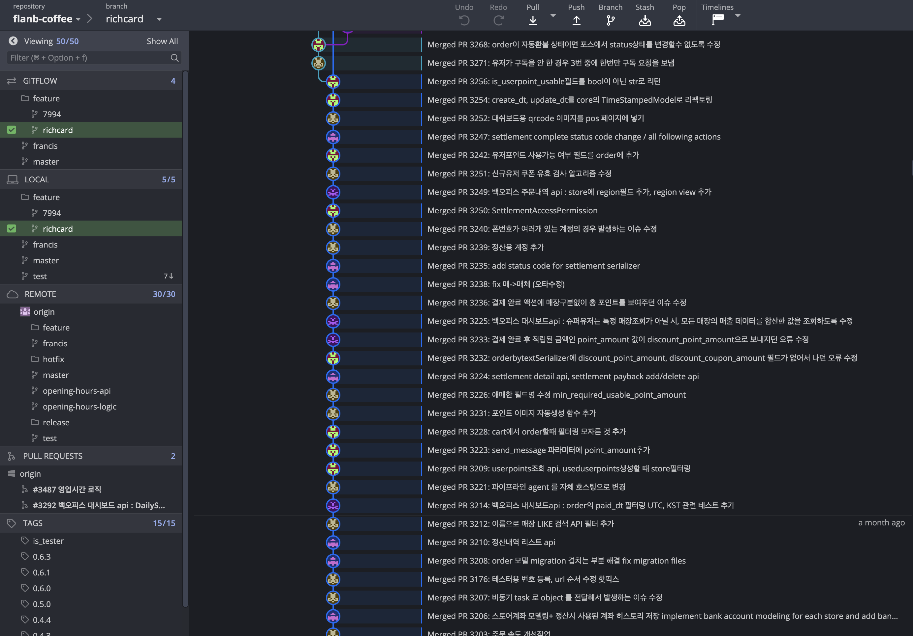

쉽게 Pull Request 를 만들 수 있고 깔끔한 그래프를 그려줘서 보기 편하다는 장점이 있습니다

- gitflow 와 [gitkraken](https://www.gitkraken.com/) 툴을 함께 사용하면 azure devops 에서 git을 더욱 편하게 관리할 수 있습니다

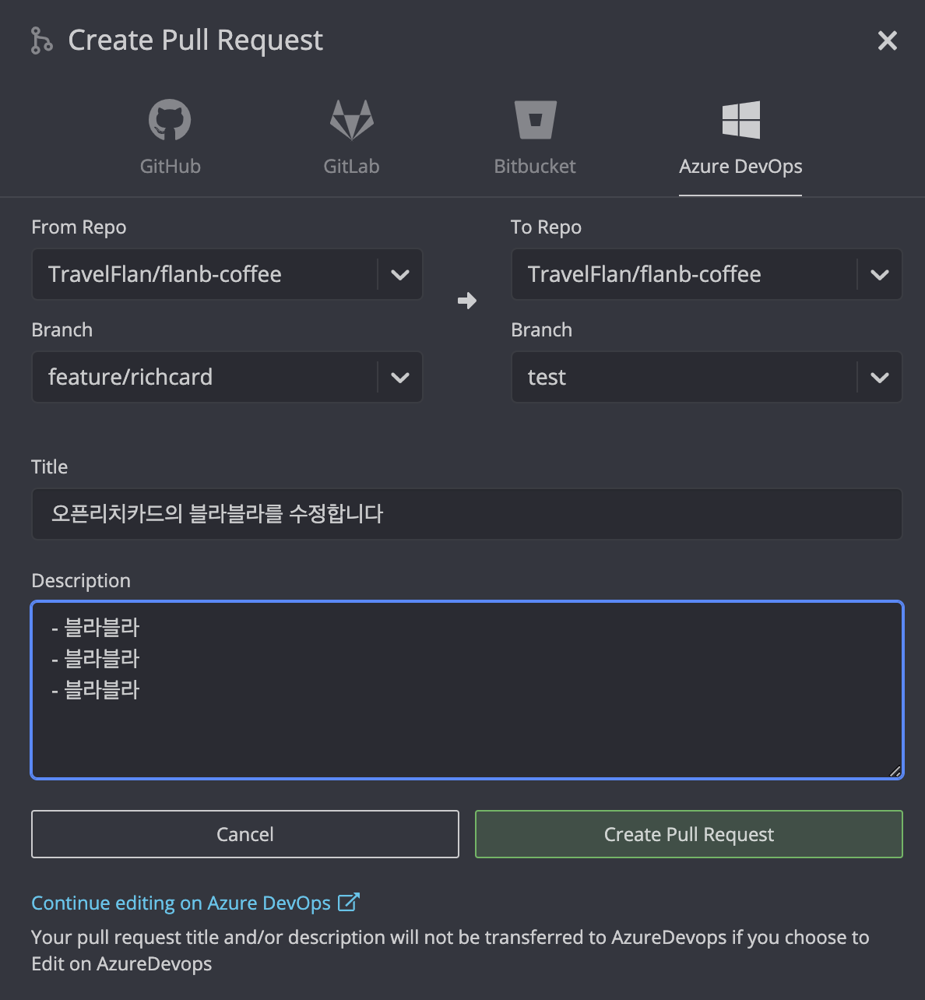

[azure devops 에서 gitkraken 사용하기](https://devtks.github.io/2019-08-09-GitFlowAzureDevops/)

### 반드시 Pull request 를 통해서만 코드가 머지될 수 있도록 합니다

- 사내 프로젝트에서는 코드가 머지되기 위해서 다음과 같은 필수 제약 조건이 있습니다

1. 반드시 2명 이상의 리뷰어가 Approve
2. 모든 코멘트가 resolve 상태
3. 한개 이상의 work item이 연결
4. 파이프라인이 정상적으로 통과
5. 모든 테스트코드가 100% 성공

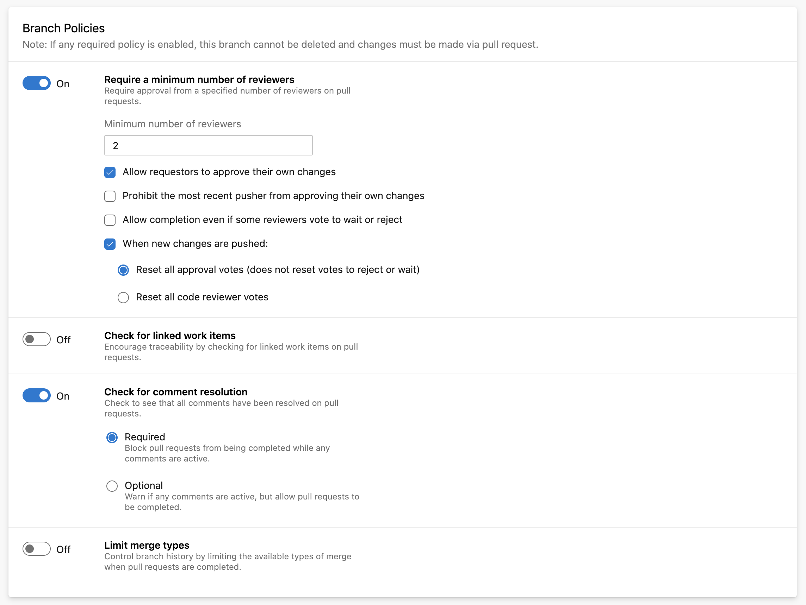

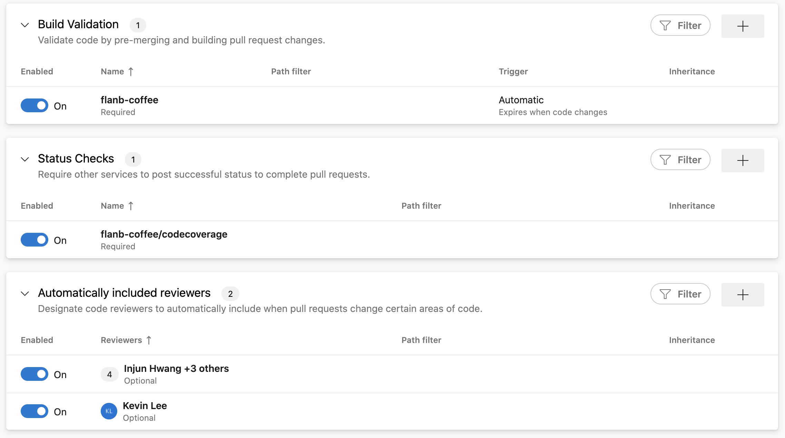

- pull request 의 description 에 구현 내용을 최대한 상세하게 적어줍니다

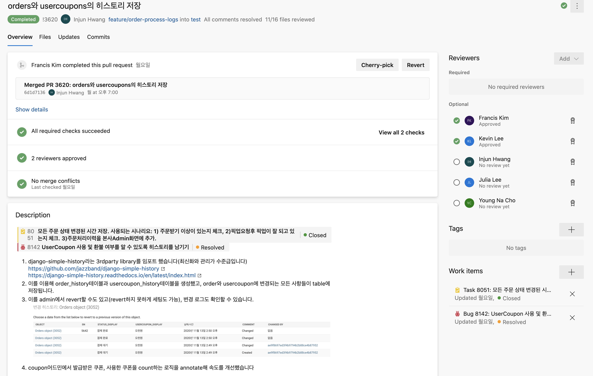

pull request 예시

### 스토리보드를 활용합니다

- 새로운 기능을 개발할때, 버그를 수정할때 티켓을 생성하고 pull request 와 연결시킵니다
- pull request 가 머지되면 자동으로 티켓이 closed 또는 resolved 됩니다

### 코드 리뷰를 반드시!!! 합니다 (제일 중요) 💯

- 코드 리뷰를 하면 리뷰어들이 코드 변경점을 숙지하게 됩니다
- 코드에 버그가 들어갈 확률이 줄어듭니다
- 코드가 조금이라도 더 깔끔해질 여지가 있습니다
- 귀찮더라도 꼭 리뷰를 해야합니다

# 코드 배포 과정

## 원클릭 배포

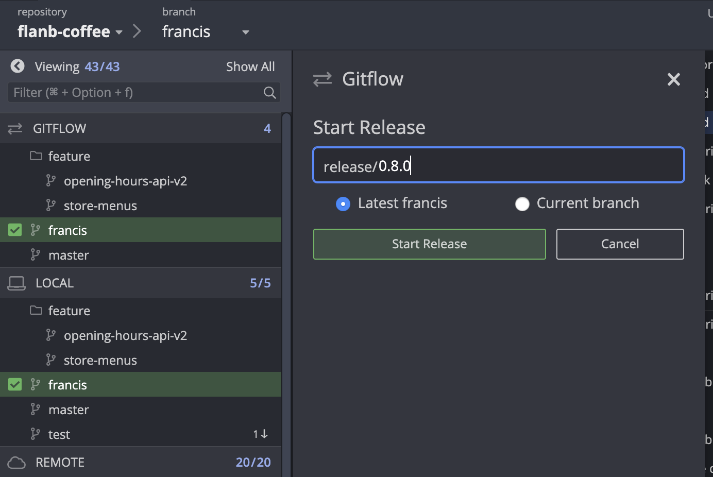

사내 프로젝트에서는 release 브랜치를 origin 서버에 푸시하면 배포되도록 설정되어있습니다

- 사내에서 사용중인 배포 파이프라인

  - 다음과 같이 브랜치로 분기합니다

    ```yaml
    trigger:
      - release/*
      - hotfix/*
      - develop

      # 중간 생략

      # test 브랜치인 경우 개발환경에 배포
      - script: |
          pipenv run python manage.py migrate
          pipenv run z update $SOURCE_BRANCH_NAME
          pipenv run z schedule $SOURCE_BRANCH_NAME
        condition: and(succeeded(), eq(variables['Build.SourceBranch'], 'refs/heads/develop'))
        displayName: 'Publish Dev'
        env:
          AWS_ACCESS_KEY_ID: $(AWS_ACCESS_KEY_ID)
          AWS_SECRET_ACCESS_KEY: $(AWS_SECRET_ACCESS_KEY)
          FLANB_DEBUG: 'True'
          SOURCE_BRANCH_NAME: $(Build.SourceBranchName)

      # release 브랜치 또는 hotfix 브랜치인 경우 운영환경에 배포
      - script: |
          pipenv run python manage.py migrate
          pipenv run z update master
          pipenv run z schedule master
        condition: and(succeeded(), contains(variables['Build.SourceBranch'], 'refs/heads/release'))
        displayName: 'Publish Production'
        env:
          AWS_ACCESS_KEY_ID: $(AWS_ACCESS_KEY_ID)
          AWS_SECRET_ACCESS_KEY: $(AWS_SECRET_ACCESS_KEY)
          FLANB_DEBUG: 'False'

      - script: |
          pipenv run python manage.py migrate
          pipenv run z update master
          pipenv run z schedule master
        condition: and(succeeded(), contains(variables['Build.SourceBranch'], 'refs/heads/hotfix'))
        displayName: 'Publish Production'
        env:
          AWS_ACCESS_KEY_ID: $(AWS_ACCESS_KEY_ID)
          AWS_SECRET_ACCESS_KEY: $(AWS_SECRET_ACCESS_KEY)
          FLANB_DEBUG: 'False'
    ```

## 승인 후 배포

사내 백엔드 프로젝트는 `pipeline`만 사용하기때문에 파이프라인에서 모든 처리가 이루어져있습니다. 하지만 상황에 따라서는 패키징만 해놓았다가 배포가 필요할때만 빠르게 배포해야 할 필요가 있을수도 있습니다. (docker 를 사용하는 경우 등) 이러한 경우 `Artifact` 를 `release` 와 함께 사용할 수 있습니다

다음은 사내 POS 용 프로그램 프로젝트에서 사용하는 배포 단계입니다

1. 배포할 브랜치에 코드를 `push`합니다
2. `pipeline` 에서 코드를 패키징합니다

   ```yaml
   - script: |
       npm run dist
     displayName: 'npm run build'
   ```

3. 패키징한 코드를 압축합니다(필요한 경우에만)

   ```yaml
   - task: ArchiveFiles@2
     condition: and(succeeded(), eq(variables['Build.SourceBranch'], 'refs/heads/master'))
     inputs:
       rootFolderOrFile: 'ara.exe'
       #includeRootFolder: true
       archiveType: 'zip' # Options: zip, 7z, tar, wim
       archiveFile: '$(Build.ArtifactStagingDirectory)/ara-$(packageVersion).zip'
       replaceExistingArchive: true
   ```

4. 압축한 코드를 `Artifact` 에 업로드합니다

   ```yaml
   - task: PublishBuildArtifacts@1
     inputs:
       pathToPublish: $(Build.ArtifactStagingDirectory)
       artifactName: pos
   ```

5. `Artifact` 에 성공적으로 업로드되면 `release` 트리거가 동작하게 됩니다.

   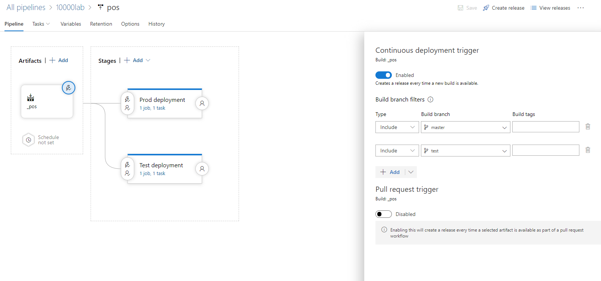

6. `stages` 단계가 트리거 되는 조건에 승인자를 추가하면 Teams 와 연동해서 배포를 승인해야만 배포 진행되도록 개발이 가능합니다

   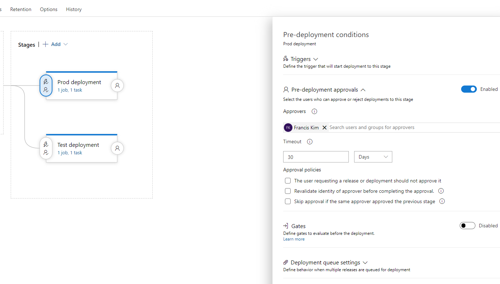

   트리거에 승인 조건을 넣고 승인자로 Francis Kim 을 추가했습니다

   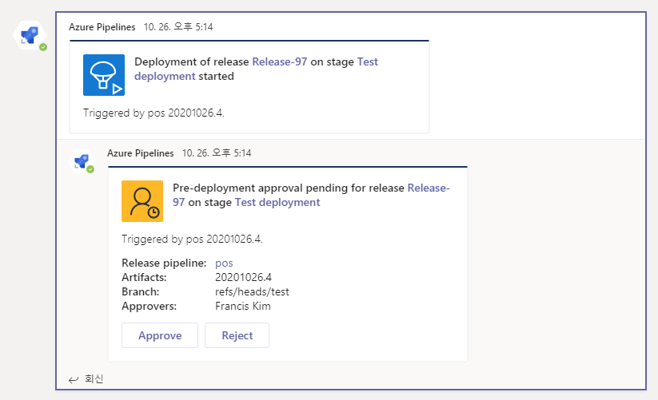

   파이프라인 챗봇에서 배포할건지 물어보는 모습

   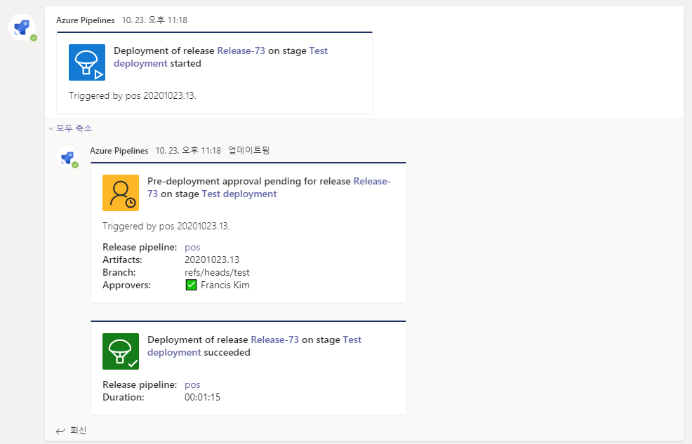

   배포 승인시 누가 언제 승인했는지와 처리 결과가 나옵니다
