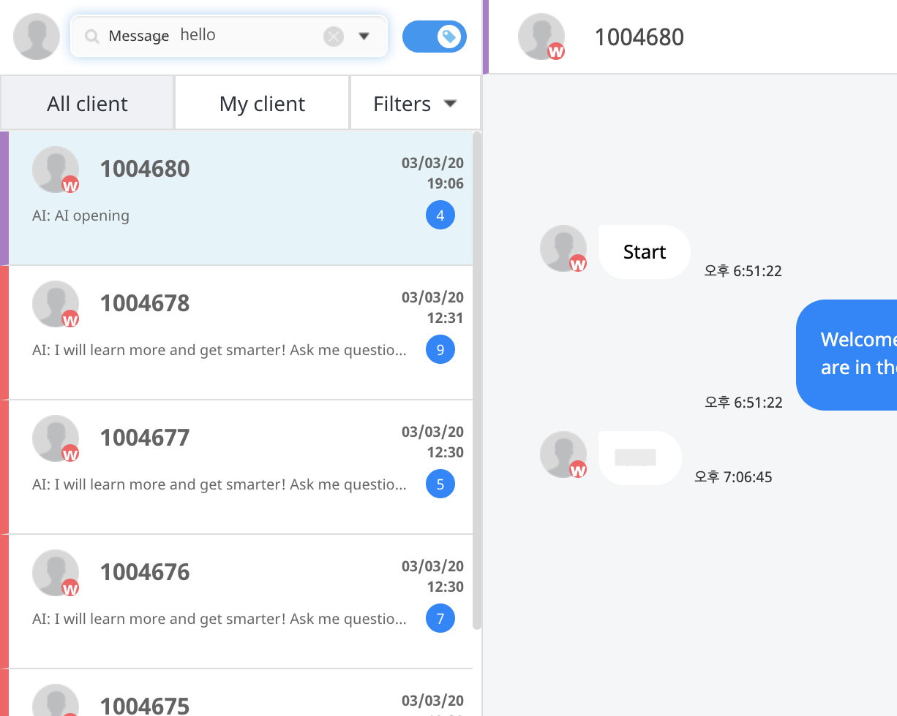
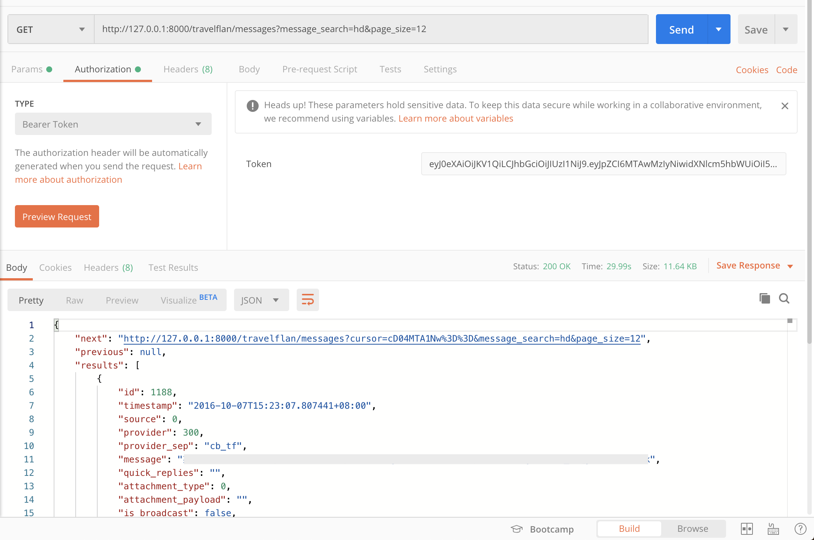

# 문제 확인

---

사내 메세지 플랫폼에 메세지 검색이 안된다는 이슈가 올라와서 확인해보니 특정 API의 응답이 유독 오래 걸리는 문제가 있었습니다



다음 endpoint 의 `GET` API 를 요청했을때 29.99초가 걸리는 것을 확인할 수 있었습니다 (`messages` 테이블의 rows 수는 현재 시점으로 약 3백만개)

`[message_search=hi&page_size=12](http://127.0.0.1:8000/travelflan/messages?ordering=-timestamp&message_search=hi&page_size=12)`



# DEBUG

---

`django-debug-toolbar` 라는 파이썬 패키지를 이용해서 쿼리 성능을 측정했습니다

다음 명령어로 설치하였습니다

```bash
pip install django-debug-toolbar
```

[`settings.py`](http://settings.py) 에 다음을 작성했습니다.

```python
if DEBUG:
    INTERNAL_IPS = ('127.0.0.1', )
    MIDDLEWARE += ('debug_toolbar.middleware.DebugToolbarMiddleware',)
    INSTALLED_APPS += ('debug_toolbar',)
    DEBUG_TOOLBAR_PANELS = [
        'debug_toolbar.panels.versions.VersionsPanel',
        'debug_toolbar.panels.timer.TimerPanel',
        'debug_toolbar.panels.settings.SettingsPanel',
        'debug_toolbar.panels.headers.HeadersPanel',
        'debug_toolbar.panels.request.RequestPanel',
        'debug_toolbar.panels.sql.SQLPanel',
        'debug_toolbar.panels.staticfiles.StaticFilesPanel',
        'debug_toolbar.panels.templates.TemplatesPanel',
        'debug_toolbar.panels.cache.CachePanel',
        'debug_toolbar.panels.signals.SignalsPanel',
        'debug_toolbar.panels.logging.LoggingPanel',
        'debug_toolbar.panels.redirects.RedirectsPanel',
    ]
    DEBUG_TOOLBAR_CONFIG = {
        'INTERCEPT_REDIRECTS': False,
    }
```

[`urls.py`](http://urls.py) 에 다음을 추가했습니다

```python
if DEBUG:
    import debug_toolbar
    urlpatterns.append(re_path(r'^__debug__/', include(debug_toolbar.urls)))
```

[`http://127.0.0.1:8000/swagger/`](http://127.0.0.1:8000/swagger/) 접속 시 오른쪽 탭에 새롭게 메뉴가 생긴 것을 확인할 수 있었습니다.


아쉽게도 swagger 에서는 debug-toolbar 가 제대로 작동되지 않아서 restframework `DEFAULT_RENDERER_CLASSES` 세팅에 `rest_framework.renderers.BrowsableAPIRenderer` 를 추가해주었습니다.

문제가 되는 API 에 매핑된 뷰는 `MessagesListView` 이고 브라우저에서 확인하기 위해 권한을 로컬에서만 살며시 `AllowAny` 로 변경해주었습니다.

# 병목 지점 확인하기

---

DEBUG 모드로 콘솔에서 한 줄씩 실행시켜 보았을 때 확실히 문제가 되는 지점은 `get_queryset` 메서드에서 쿼리하는 부분이었습니다.

```python
def get(self, request, format=None, **kwargs):
        objs = self.get_queryset(**kwargs)  # 이 부분
    page = self.paginate_queryset(objs)
```

메서드 내부를 확인해보니 커스텀 `APIView` 클래스 내부의 `get_queryset` 에서 message_search 파라미터를 입력 받을 시 쿼리를 루프를 돌며 즉시 실행시켜 lazy 쿼리의 이점을 볼수 없는 상태였습니다

```python
if 'message_search' in self.request.query_params:
  ...
 self.queryset = self.queryset.filter(id__in=[obj['id'] for obj in queryset])
```

postgresql 은 장고를 위한 \_\_search 필터를 지원 하므로 변경해 주었습니다. 설치된 앱 목록에 다음을 추가함으로써 위의 쿼리를 제거할 수 있게 되었습니다

```python
INSTALLED_APPS = [
 ...
 'django.contrib.postgres',
 ...
]
```

쿼리 실행 시점이 달라졌을 뿐 그래도 실행 시간은 비슷했습니다.

```python
def get(self, request, format=None, **kwargs):
        objs = self.get_queryset(**_kwargs)  # 쿼리 실행 시점이 이 부분에서
    page = self.paginate_queryset(objs)  # 이 부분으로 변경되었습니다
```

debug_toolbar 에서 확인하기 위해 브라우저에서 API를 그대로 입력했습니다

총 25개의 쿼리 중에서 20개가 비슷하고 2개가 중복 되었다고 합니다.


문제가 많았지만 (N+1 쿼리 문제는 다른 포스팅에서 다루겠습니다) 제일 큰 문제가 되는 것은 맨 아래 8.79 ms 걸린 쿼리였습니다. 58초 이상 걸리는 저 쿼리는 실제로 확인해보니 소요되는 시간이 2초도 안 걸렸습니다. (디버그 툴바의 버그인것 같습니다)


쿼리를 단순화 해보면 다음과 같은 쿼리입니다. 실행하니 28초가 소요되었습니다

```sql
EXPLAIN ANALYZE SELECT DISTINCT "flanb_messages"."id", "flanb_messages"."timestamp", "flanb_messages"."message"
FROM "flanb_messages"
INNER JOIN "flanb_user" ON ("flanb_messages"."user_id" = "flanb_user"."id")
WHERE (to_tsvector(COALESCE("flanb_messages"."message", '')) @@ (plainto_tsquery('hi')) = true)
ORDER BY "flanb_messages"."timestamp" DESC
```

# 속도 개선

---

## timestamp 필드 인덱싱 해보기

drf 에서 제공하는 CursorPagination 을 제대로 사용하기 위해서는 데이터베이스 인덱스가 걸려 있어야 한다고 합니다[(링크)](https://www.django-rest-framework.org/api-guide/pagination/#cursorpagination). 오더링에 사용 되는 `timestamp` 컬럼에 인덱스가 걸려 있지 않아서 다음과 같이 인덱스를 걸어 주었습니다.

```python
class Meta:
        db_table = 'flanb_messages'
        indexes = [
            models.Index(fields=('timestamp',))
        ]
```

timestamp 인덱싱 후에도 속도가 크게 개선되지 않아 찾아보던 중 rdbms like 검색은 기본적으로 느리기때문에 full text search 를 위해서 GIN index 를 사용하라는 글을 발견했습니다.

`message` 필드를 full text search 를 하기 위해서 [링크](https://www.postgresql.org/docs/9.5/textsearch-tables.html#TEXTSEARCH-TABLES-INDEX)에 나오는 대로 GIN index를 생성했습니다

## tsvector 컬럼 생성

새롭게 tsvector 타입의 컬럼을 생성했습니다

```sql
ALTER TABLE flanb_messages ADD COLUMN tsv_message tsvector;
```

새롭게 GIN index 를 생성했습니다

```sql
CREATE INDEX tsv_message_idx ON flanb_messages USING gin(tsv_message);
```

새로운 컬럼에 가중치를 부여했습니다

```sql
UPDATE flanb_messages SET tsv_message = setweight(to_tsvector(coalesce(message,'')), 'A')
```

이제 기존 데이터는 문제가 없지만 새롭게 생성되는 데이터들을 위해서 함수를 만들었습니다

```sql
CREATE FUNCTION message_search_trigger() RETURNS trigger AS $$
begin
  new.tsv_message :=
    setweight(to_tsvector(coalesce(new.message,'')), 'A');
return new;
end
$$ LANGUAGE plpgsql;
```

Insert 또는 Update 시에 자동으로 위에 생성한 함수를 실행할 수 있도록 트리거를 생성했습니다

```sql
CREATE TRIGGER tsvector_message_update BEFORE INSERT OR UPDATE
ON flanb_messages FOR EACH ROW EXECUTE PROCEDURE message_search_trigger();
```

조건문을 새롭게 생성한 컬럼 `tsv_message` 으로 변경하고 쿼리 실행 계획을 보니 2.3초로 줄어들었습니다!

```sql
EXPLAIN ANALYZE SELECT DISTINCT "flanb_messages"."id", "flanb_messages"."timestamp", "flanb_messages"."message"
FROM "flanb_messages"
INNER JOIN "flanb_user" ON ("flanb_messages"."user_id" = "flanb_user"."id")
WHERE tsv_message @@ (plainto_tsquery('hi')) = true
ORDER BY "flanb_messages"."timestamp" DESC
```

# Django 에서 활용하기

---

위 처럼 쿼리를 직접 사용하여 디비를 수정해도 되지만 코드의 일관성을 향상시키기위해 django 가 관리하는 migrations 파일에서 다루는 것이 맞다는 생각이 들었습니다

Django 코드에서 활용하기 위해서 `tsvector` 타입의 컬럼을 추가 했습니다

```python
from django.contrib.postgres.search import SearchVectorField
class Messages(models.Model):
 ...
 tsv_message = SearchVectorField(null=True)
 ...
```

tsv_message 필드에 대해 GIN 인덱스를 설정했습니다

```python
from django.contrib.postgres.indexes import GinIndex

class Meta:
        db_table = 'flanb_messages'
        indexes = [
            models.Index(fields=('timestamp',)),
      GinIndex(fields=('tsv_message',))
        ]
```

실 서버에 배포 시 자동으로 위 동작을 반영할 수 있도록 migrations 파일을 수정했습니다

```python
operations = [
        migrations.AddField(
            model_name='messages',
            name='tsv_message',
            field=django.contrib.postgres.search.SearchVectorField(null=True),
        ),
        migrations.AddIndex(
            model_name='messages',
            index=django.contrib.postgres.indexes.GinIndex(fields=['tsv_message'], name='tsv_message_idx'),
        ),
        migrations.RunSQL(
            '''
            CREATE FUNCTION message_search_trigger() RETURNS trigger AS $$
            begin
            new.tsv_message :=
                setweight(to_tsvector(coalesce(new.message,'')), 'A');
            return new;
            end
            $$ LANGUAGE plpgsql;
            ''',
        ),
        migrations.RunSQL(
            '''
            CREATE TRIGGER tsvector_message_update BEFORE INSERT OR UPDATE
            ON flanb_messages FOR EACH ROW EXECUTE PROCEDURE message_search_trigger();
            ''',
        ),
        migrations.RunSQL(
            '''
            UPDATE flanb_messages SET tsv_message = setweight(to_tsvector(coalesce(message,'')), 'A')
            ''',
        ),
    ]
```

배포 후 API 호출시 매우 빠르게 호출되는 모습을 확인할 수 있었습니다


