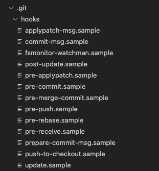

- [git hook 이란?](#git-hook-이란)
- [pre-commit 이란?](#pre-commit-이란)
- [pre-commit 설치하기](#pre-commit-설치하기)
- [pre-commit 세팅하기](#pre-commit-세팅하기)
  - [설정 파일 추가](#설정-파일-추가)
  - [black 추가](#black-추가)
  - [flake8 추가](#flake8-추가)
  - [autoflake 추가](#autoflake-추가)
  - [isort 추가](#isort-추가)
  - [세팅 최종 결과물](#세팅-최종-결과물)
- [pre-commit 실행하기](#pre-commit-실행하기)
  - [모든 파일에 pre-commit 적용하기](#모든-파일에-pre-commit-적용하기)
- [마무리](#마무리)

## git hook 이란?

git 에는 `commit` 이나 `push` 같은 특정 이벤트가 생겼을 때 동작하는 hook 이 존재합니다.
`.git/hooks` 폴더로 들어가보면 여러가지 `hook` 에 대한 sample 파일들이 존재하는 것을 확인할 수 있습니다.



사용 가능한 hook 의 종류는 sample 에 있는 것처럼 다음과 같습니다.

- applypatch-msg
- commit-msg
- fsmonitor-watchman
- post-update
- pre-applypatch
- pre-commit
- pre-merge-commit
- pre-push
- pre-rebase
- pre-receive
- prepare-commit-msg
- push-to-checkout
- update

우리는 이 중에서 `pre-commit hook` 만 다룰것이기 때문에 자세한 내용이 궁금하신 분은 [이 글을](https://git-scm.com/docs/githooks) 읽어주시기 바랍니다.

## pre-commit 이란?

[pre-commit](https://pre-commit.com/) 은 앞서 설명했던 git hook 에서 지원하는 기능중 `pre-commit hook` 을 관리하고 유지하기 위한 프레임워크입니다.

우리는 이 `pre-commit` framework 를 사용해서 코드를 `git commit` 하기 전에 `lint` 검사를 할 수 있도록 만들것입니다.

## pre-commit 설치하기

다음과 같이 pip 명령어를 사용해서 설치합니다.

```sh
pip install pre-commit
```

또는 `homebrew` 를 사용해서 설치할 수도 있습니다.

```sh
brew install pre-commit
```

설치되었다면 pre-commit --version 를 입력했을때 다음과 같이 버전이 표시됩니다.

```sh
$ pre-commit --version
pre-commit 2.16.0
```

## pre-commit 세팅하기

### 설정 파일 추가

`.pre-commit-config.yaml` 파일을 프로젝트 폴더에 생성하고 다음과 같이 기본 설정을 입력합니다.

```yml
repos:
  - repo: https://github.com/pre-commit/pre-commit-hooks
    rev: v2.3.0
    hooks:
      - id: check-yaml
      - id: end-of-file-fixer
      - id: trailing-whitespace

default_language_version:
  python: python3.10
```

- check-yaml: 모든 yaml 파일의 구문이 맞는지 확인합니다.
- end-of-file-fixer: 모든 파일의 끝에 new line 이 없으면 추가합니다.
- trailing-whitespace 모든 라인의 끝에 공백이 있는지 확인하고 있으면 삭제합니다.

`pre-commit` 에서 기본적으로 제공하는 훅의 종류는 [여기에서](https://github.com/pre-commit/pre-commit-hooks) 확인할 수 있습니다.

### black 추가

python package 중 하나인 `black` 은 pre-commit hook 을 지원합니다.

`.pre-commit-config.yaml` 파일에 다음과 같이 추가합니다.

```yml
- repo: https://github.com/psf/black
  rev: 21.11b1
  hooks:
    - id: black
```

### flake8 추가

`pep8` 문법을 지원하는 `flake8` 은 pre-commit hook 을 지원합니다.

`.pre-commit-config.yaml` 파일에 다음과 같이 추가합니다.

```yml
- repo: https://gitlab.com/PyCQA/flake8
  rev: 4.0.1
  hooks:
    - id: flake8
      args: [--max-line-length=120]
```

args 문법을 사용해서 flag 를 추가할 수 있습니다.

### autoflake 추가

`flake8` 은 검사를 해주지만 자동으로 변경해주지는 않습니다.

`autoflake` 를 `.pre-commit-config.yaml` 파일에 추가해서 `flake8` 검사 전에 자동으로 변경될 수 있도록 설정합니다.

```yml
- repo: https://github.com/myint/autoflake
  rev: v1.4
  hooks:
    - id: autoflake
      args:
        - --in-place
        - --remove-unused-variables
        - --remove-all-unused-imports
        - --expand-star-imports
- repo: https://gitlab.com/PyCQA/flake8
  rev: 4.0.1
  hooks:
    - id: flake8
      args: [--max-line-length=120]
```

### isort 추가

import 순서를 자동으로 정렬해주는 `isort` 은 pre-commit hook 을 지원합니다.

`.pre-commit-config.yaml` 파일에 다음과 같이 추가합니다.

```yml
- repo: https://github.com/pycqa/isort
  rev: 5.10.1
  hooks:
    - id: isort
      name: isort (python)
```

### 세팅 최종 결과물

모든 설정이 추가되면 다음과 같습니다.

```yml
repos:
  - repo: https://github.com/pre-commit/pre-commit-hooks
    rev: v2.3.0
    hooks:
      - id: check-yaml
      - id: end-of-file-fixer
      - id: trailing-whitespace
  - repo: https://github.com/psf/black
    rev: 21.11b1
    hooks:
      - id: black
  - repo: https://github.com/myint/autoflake
    rev: v1.4
    hooks:
      - id: autoflake
        args:
          - --in-place
          - --remove-unused-variables
          - --remove-all-unused-imports
          - --expand-star-imports
  - repo: https://gitlab.com/PyCQA/flake8
    rev: 4.0.1
    hooks:
      - id: flake8
        args: [--max-line-length=120]
  - repo: https://github.com/pycqa/isort
    rev: 5.10.1
    hooks:
      - id: isort
        name: isort (python)
default_language_version:
  python: python3.10
```

## pre-commit 실행하기

pre-commit 을 실행하기 위해서는 `.git/hooks/pre-commit` 내용을 변경하는 명령을 최초 한번 실행해야 합니다.

```sh
$ pre-commit install
pre-commit installed at .git/hooks/pre-commit
```

이제 커밋할 때마다 pre-commit 이 실행되며 자동으로 파일이 수정됩니다.

### 모든 파일에 pre-commit 적용하기

pre-commit 은 commit 하는 파일에 한해서만 동작합니다.

만약 진행중인 프로젝트에 pre-commit 을 적용하시는거라면 다음 명령어를 통해서 모든 파일에 적용시킬 수 있습니다.

```sh
$ pre-commit run --all-files

[INFO] Stashing unstaged files to /Users/user/.cache/pre-commit/patch1642078050-8233.
Check Yaml..............................................................Passed
Fix End of Files........................................................Passed
Trim Trailing Whitespace................................................Passed
black...................................................................Passed
autoflake...............................................................Passed
flake8..................................................................Passed
isort (python)..........................................................Passed
[INFO] Restored changes from /Users/user/.cache/pre-commit/patch1642078050-8233.
On branch main
Your branch is up to date with 'origin/main'.
```

## 마무리

pre-commit 을 이용하면 커밋하기 전 실수를 줄일 수 있고 리뷰 할 때도 lint 에 대해 전혀 신경쓰지 않아도 되어서 편리합니다.
아직 프로젝트에 사용해 보신적이 없다면 한번 사용해 보시는 것을 권장해드립니다.
