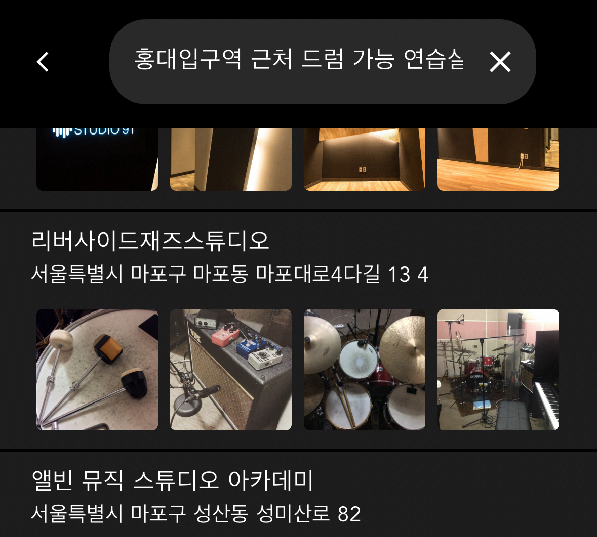

- [개요](#개요)
- [본론](#본론)
  - [초기 접근: 기본적인 검색 방법의 한계](#초기-접근-기본적인-검색-방법의-한계)
  - [임베딩 서치로의 전환](#임베딩-서치로의-전환)
  - [하이브리드 서치의 발견](#하이브리드-서치의-발견)
  - [외부 서비스 사용 고민](#외부-서비스-사용-고민)
  - [구현 과정의 어려움](#구현-과정의-어려움)
  - [성능 개선을 위한 노력](#성능-개선을-위한-노력)
  - [메타데이터 활용](#메타데이터-활용)
  - [최종 구현](#최종-구현)
  - [예상치 못한 발견](#예상치-못한-발견)
- [결론](#결론)

## 개요

나는 [studiofy](https://studiofy.kr) 라는 앱을 개발하고 있다. 이 앱은 음악 연습실을 찾는 사람들과 음악 연습실을 제공하는 사람들을 연결해주는 플랫폼이다. 

이 앱에는 검색 기능이 필수적이었는데, 검색 기능을 구현하는 것은 생각보다 복잡한 과정이었다.  

특히 한국어 검색에서 발생하는 문제들을 해결하기 위해 다양한 방법을 시도했고, 그 과정에서 많은 것을 배웠다. 

이 글에서는 내가 겪은 검색 구현의 여정을 공유하고자 한다.

## 본론

### 초기 접근: 기본적인 검색 방법의 한계

처음에는 like 쿼리를 사용해 검색을 구현하려 했다. 하지만 이 방법은 속도가 느리다는 단점이 있었다.  

django 에서 내장된 [TrigramSimilarity](https://docs.djangoproject.com/en/5.1/ref/contrib/postgres/search/#trigramsimilarity) 를 사용하는 방법으로 트라이그램 유사도 서치를 고려해봤지만, trgm 인덱스는 한국어를 지원하지 않아 사용할 수 없었다. 

바이그램 유사도 서치는 어느 정도 쓸만했지만, `홍대 근처 드럼연습실`과 같은 실제 유용한 검색에서는 원하는 결과를 얻기 힘들었다.

### 임베딩 서치로의 전환

다음으로 openai 의 임베딩을 이용해 임베딩 서치를 시도했다. 이 방법은 유사도를 비교해 자연어로 검색할 수 있다는 장점이 있었다. 

pgvector를 사용하면 임베딩을 제외한 모든 부분에서 외부 서비스 없이 데이터베이스에서 직접 서비스할 수 있었다. 

하지만 여전히 문제가 있었다. `홍대 근처 드럼연습실` 을 검색했을 때, 홍대에 있지만 `드럼과 관련 없는 연습실`이나 `부산`에 있는 드럼연습실도 검색 결과로 나왔다.

### 하이브리드 서치의 발견

이런 문제를 해결하기 위해 하이브리드 서치라는 개념을 알게 되었다.

희소벡터를 이용하는 [BM25](https://en.wikipedia.org/wiki/Okapi_BM25)와 밀집벡터를 이용하는 임베딩을 결합한 방식이었다. 

처음에는 네이버에서 만든 [SPLADE](https://github.com/naver/splade)가 BM25보다 좋다고 생각했지만, 한국어를 지원하지 않아 결국 BM25를 선택했다.

### 외부 서비스 사용 고민

처음에는 의존도를 이유로 PostgreSQL에서 최대한 많은 기능을 구현하고 싶었다.

하지만 BM25는 PostgreSQL에서 직접 지원하는 익스텐션이 없어서 별도의 서버가 필요했다. 이런 상황에서 [Pinecone](https://www.pinecone.io/)이라는 외부 서비스를 고려하게 되었다.

### 구현 과정의 어려움

Pinecone을 사용하기로 결정했지만, 여전히 문제가 있었다. 

BM25 모델을 만들려면 모든 데이터에 대한 문서가 필요했고, 이를 위해 S3에 사전 정의된 데이터를 올리고 쿼리할 때 다운받는 방식을 사용했다. 

### 성능 개선을 위한 노력

토크나이즈 과정에서 불필요한 조사 등을 제거하고 임베딩 벡터와 크기를 맞추는 작업을 진행했다. 

임베딩만 할 때는 괜찮았지만, BM25를 섞는 순간 문제가 발생했다.

여러 번의 시도 끝에 BM25와 임베딩의 비율을 0.04:0.96으로 설정했을 때 가장 좋은 결과를 얻을 수 있었다.

### 메타데이터 활용

완벽한 검색을 구현하기 위해 메타데이터를 추가했다. "OO역", "드럼", "피아노" 같은 사전 정의 데이터로 벡터 서치를 제한하니 훨씬 나은 결과를 얻을 수 있었다.

### 최종 구현

최종적으로 광고 API, 바이그램 유사도 서치 API, 하이브리드 서치 API를 동시에 요청하고 결과를 조합해 보여주는 방식을 채택했다. 

모든 검색에 하이브리드 서치를 사용할 필요는 없어서, 띄어쓰기가 있을 때만 요청하도록 최적화했다.

### 예상치 못한 발견

또한, Upstage 임베딩을 사용했을 때 BM25를 섞는 것보다 단독으로 사용하는 것이 더 좋은 성능을 보여 결국 하이브리드서치를 버리고 pgvector로 회귀하게 되었다.

## 결론

검색 기능 구현은 예상보다 복잡하고 많은 시행착오가 필요한 과정이었다. 

다양한 방법을 시도하고, 각 방법의 장단점을 파악하며, 최종적으로 우리 서비스에 가장 적합한 솔루션을 찾아낼 수 있었다. 

이 과정에서 얻은 경험과 지식은 앞으로의 개발 과정에서 큰 자산이 될 것이다. 검색 기술은 계속해서 발전하고 있으므로, 앞으로도 새로운 방법과 기술을 탐구하고 적용해 나갈 것이다.
