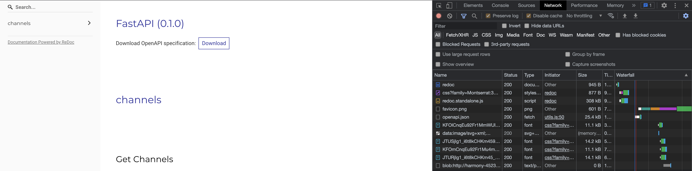
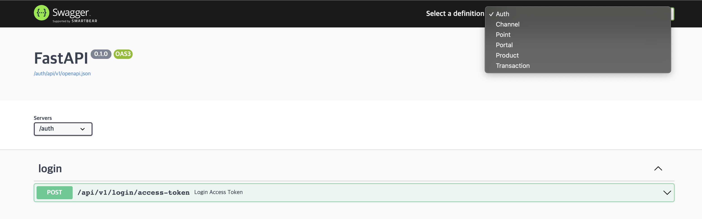

- [개요](#개요)
- [Swagger가 뭐죠?](#swagger가-뭐죠)
- [OpenAPI는 또 뭔가요?](#openapi는-또-뭔가요)
- [문제 해결](#문제-해결)
  - [openapi 스펙 문서 경로 찾기](#openapi-스펙-문서-경로-찾기)
  - [swagger ui 별도 서버 띄우기](#swagger-ui-별도-서버-띄우기)
  - [openapi 스펙 링크 연결하기](#openapi-스펙-링크-연결하기)
  - [reverse proxy 로 경로 제공하기](#reverse-proxy-로-경로-제공하기)
- [마무리](#마무리)

## 개요

최근 사내에서 `msa` 를 도입하게 되면서 `Swagger` 또한 도입하게 되었습니다.  
우리는 `fastapi` 를 사용하기 때문에 간편하게 `redoc` 과 `swagger` 를 자동으로 생성해주지만
`msa` 를 하면 각자 서비스마다 `swagger` 가 따로 따로 생성되어 front-end 개발자들과 문서를 공유하기 번거로운 문제가 발생했습니다.  
각 서비스의 `swagger` 를 하나씩은 볼 수 있지만 전체적으로 어떤 서비스가 존재하는지 알 수 없기 때문이었습니다.  
오늘은 `Swagger` 를 도입하게 되면서 알게 된 방법을 공유하려고 합니다.

## Swagger가 뭐죠?

[Swagger](https://swagger.io/) 는 서버의 api 스펙을 `OpenAPI`를 기반으로 자동으로 문서화 시켜주는 오픈소스 도구입니다.

## OpenAPI는 또 뭔가요?

[OpenAPI](https://swagger.io/specification/) 는 Swagger 프로젝트의 일부였던 Swagger Specification 입니다.  
현재는 독립된 프로젝트로써 API 스펙의 공통 규격이 되었습니다.  
`Swagger` 의 대안격인 [redoc](https://github.com/Redocly/redoc) 과 [slate](https://github.com/slatedocs/slate) 또한 `OpenAPI` 를 기반으로 생성됩니다.

## 문제 해결

### openapi 스펙 문서 경로 찾기

우리는 `fastapi` 를 사용해서 다음과 같이 `redoc`을 사용하고 있었습니다.

```python
app = FastAPI(redoc_url="/redoc", openapi_url=f"{settings.API_V1_STR}/openapi.json")
```

`fastapi` 를 사용하지 않더라도 다음과 같이 `redoc` 페이지에서 개발자 모드로 확인 가능합니다.



우리의 경우에는 `{{host}}/api/v1/openapi.json` 에 존재하고 있었습니다.

### swagger ui 별도 서버 띄우기

`openapi` 스펙문서만 가지고있으면 `swagger` 에서 제공하는 [swagger-ui](https://github.com/swagger-api/swagger-ui/) 를 사용해서 별도의 서버를 띄우는것이 가능합니다.  
`swagger-ui` 에서 제공하는 `docker image` 를 이용해서 `docker compose` 내부에 `continer` 를 연결했습니다.

docker-compose.yml

```yml
# docker-compose.yml
version: '3'
....
swagger:
  image: swaggerapi/swagger-ui
```

### openapi 스펙 링크 연결하기

다음과 같이 `environment` 를 통해 `openapi.json` 경로를 연결시켜주었습니다.

```yml
# docker-compose.yml
version: '3'
....
swagger:
  image: swaggerapi/swagger-ui
  ports:
   - 8080:8080
  environment:
    - URLS=
      [
      {url:'localhost/auth/api/v1/openapi.json',name:'Auth'},
      {url:'localhost/channel/api/v1/openapi.json',name:'Channel'},
      {url:'localhost/point/api/v1/openapi.json',name:'Point'},
      {url:'localhost/portal/api/v1/openapi.json',name:'Portal'},
      {url:'localhost/product/api/v1/openapi.json',name:'Product'},
      {url:'localhost/transaction/api/v1/openapi.json',name:'Transaction'},
      ]
```

이렇게 하면 외부에서 `localhost:8080` 으로 들어가면 `swagger` 로 접근할 수 있게 됩니다.

그리고 다음과 같이 Select a definition 를 통해서 여러 서비스의 swagger 로 접근 가능하도록 변경되었습니다.



하지만 좀 더 깔끔하게 접근할 수 있도록 url 엔드포인트를 만들어 보았습니다.

### reverse proxy 로 경로 제공하기

우리는 이미 다른 마이크로 서비스들을 라우팅하기 위해 `nginx` 를 `reverse proxy` 로써 사용하고 있었습니다.

```conf
# nginx.conf
...
http {

    server {

      listen 80;

      location /status {
        return 200 "OK";
      }

      location /auth/ {
        proxy_pass http://localhost:5001/;
      }
      ...
    }
}
```

위와 같은 `nginx.conf` 설정 파일에 다음과 같이 `/docs/` 경로를 추가해 주었습니다.

```conf
# nginx.conf
...
http {

    server {

      listen 80;

      location /status {
        return 200 "OK";
      }

      location /docs/ {
        proxy_pass http://localhost:8080/;
      }

      location /auth/ {
        proxy_pass http://localhost:5001/;
      }
      ...
    }
}
```

그리고 나서 `docker-compose.yml` 파일도 다음과 같이 ports 를 제거하고, url 환경변수에서 호스트를 제거하는 방법으로 변경했습니다

```yml
# docker-compose.yml
version: '3'
....
swagger:
  image: swaggerapi/swagger-ui
  environment:
    - URLS=
      [
      {url:'/auth/api/v1/openapi.json',name:'Auth'},
      {url:'/channel/api/v1/openapi.json',name:'Channel'},
      {url:'/point/api/v1/openapi.json',name:'Point'},
      {url:'/portal/api/v1/openapi.json',name:'Portal'},
      {url:'/product/api/v1/openapi.json',name:'Product'},
      {url:'/transaction/api/v1/openapi.json',name:'Transaction'},
      ]
```

이제 `localhost:8080` 으로는 접근 불가능하고 `localhost/docs` 로만 접근 가능하도록 변경되었습니다.

## 마무리

`swagger` 는 건실한 후원 재단이 있는 좋은 오픈소스인 것 같습니다.
`swagger` 를 잘 사용하면 별도의 문서 필요없이 front-end 개발자들과 원활한 소통이 가능합니다.  
지금까지는 `postman` 을 통한 api 스펙 문서 관리를 했지만, 이제부터는 redoc 과 함께 swagger 를 잘 사용해보려고 합니다.  
읽어주셔서 감사합니다.
