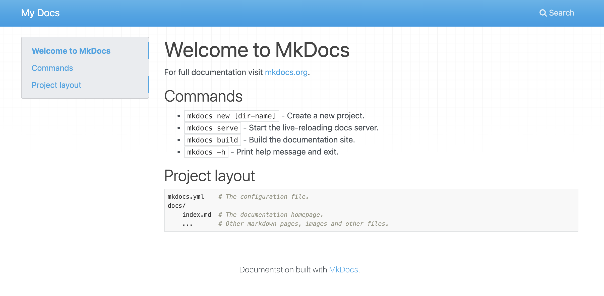
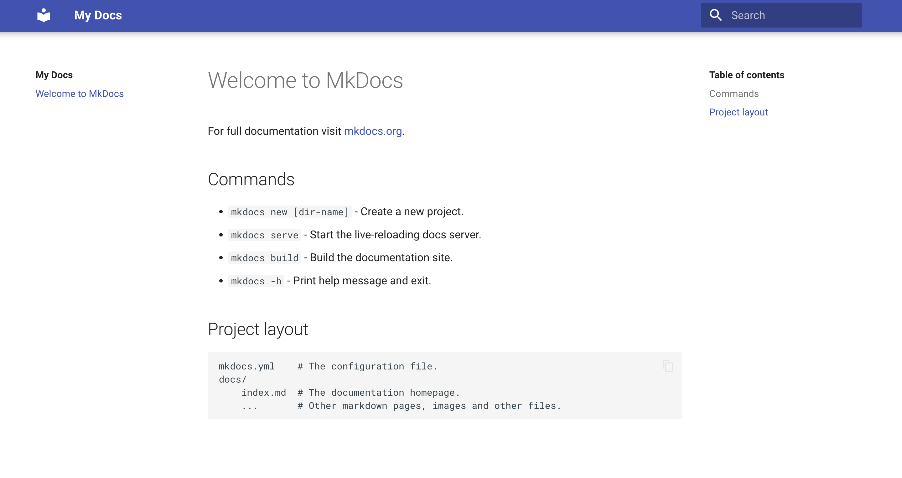
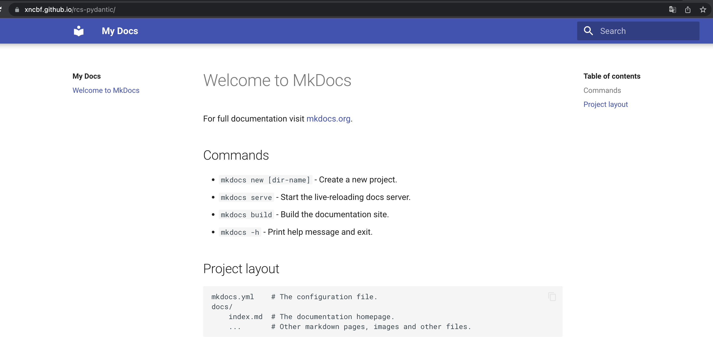

- [개요](#개요)
- [내가 지금까지 사용했던 방법](#내가-지금까지-사용했던-방법)
- [여러 오픈소스들의 문서화 스타일](#여러-오픈소스들의-문서화-스타일)
  - [Zappa 스타일](#zappa-스타일)
  - [Django 스타일](#django-스타일)
  - [Cython 스타일](#cython-스타일)
  - [FastAPI 스타일](#fastapi-스타일)
- [문서 생성하기](#문서-생성하기)
  - [mkdocs-material 설치](#mkdocs-material-설치)
  - [빈 문서 페이지 만들기](#빈-문서-페이지-만들기)
  - [로컬에서 문서페이지 띄우기](#로컬에서-문서페이지-띄우기)
  - [Theme 변경하기](#theme-변경하기)
- [github page 로 호스팅하기](#github-page-로-호스팅하기)
  - [빌드](#빌드)
  - [배포](#배포)
- [여담](#여담)

## 개요

최근 오픈소스를 만들고 운영하면서 모두가 이해할 수 있도록 문서화에 신경을 쓰게 되었는데

어떻게 하면 문서화를 좀 더 잘 할 수 있을까 생각 하다보니 오픈소스 문서에 대해 찾아보게 되었습니다.

## 내가 지금까지 사용했던 방법

저는 `README.md` 를 잘 활용하는 편이었습니다.

그래서 이 블로그도 markdown 으로 만들고, 회사 프로젝트나 개인 프로젝트, 이력서 등등을 markdown 으로 만들었습니다.

제가 사용했던 방법은 [Zappa](https://github.com/zappa/Zappa) 오픈소스가 사용한 방법처럼 하나의 md 파일에 모든 설명을 넣는것이었습니다.

그런데 다른 오픈소스들은 문서를 어떻게 만드는지 궁금해서 찾아보았고 찾아본것들에 대해 짧게 소개하겠습니다.

## 여러 오픈소스들의 문서화 스타일

### Zappa 스타일

[Zappa (python 을 위한 서버리스 프레임워크)](https://github.com/zappa/Zappa)

제가 사용한 방식과 동일합니다.

`README.md` 파일에 모든 설명을 다 넣었기 때문에 github 에서 repository 에 들어가자마자 설명이 보입니다.

모든 텍스트가 한 파일에 있고 목차가 잘 되어있기 때문에 검색하기 편리합니다.

별도의 호스팅이 필요없다는 장점도 있습니다.

하지만 스타일이 없어서 단조롭고 문서의 양이 많아지면 페이지가 느려지는 단점이 있습니다.

### Django 스타일

[Django](https://www.djangoproject.com/)  
[Django 문서 소스코드](https://github.com/django/djangoproject.com)

django 에서는 문서가 워낙 방대하다보니 웹사이트가 별도로 존재합니다.

웹사이트는 django template (Jinja2) 으로 만들어졌습니다.

직접 만들기 때문에 UI가 수려하고 커스텀하기 쉽다는 장점이 있지만 아무래도 웹사이트를 통째로 만드는것이다보니 시간이 많이 들고 직접 호스팅 해야 한다는 단점이 있습니다.

### Cython 스타일

[Cython](https://cython.readthedocs.io/) 문서는 [Sphinx](https://www.sphinx-doc.org/) 로 생성되고, [Read the docs](https://readthedocs.org/) 로 호스팅되었습니다.

스핑크스 + readthedocs 조합은 위의 단점들을 모두 보완하면서 빠르게 문서 웹사이트를 만들 수 있다는 장점이 있습니다.

하지만 현재 기준으로는 UI가 너무 구식인것같은 느낌이 듭니다.

### FastAPI 스타일

[Fastapi](https://fastapi.tiangolo.com/) 문서는 [mkdocs-material](https://squidfunk.github.io/mkdocs-material/)로 만들어졌습니다.

mkdocs 는 Sphinx 처럼 쉽게 문서를 생성할 수 있다는 장점과 github page 로 호스팅도 가능하며, theme 을 자유롭게 변경할 수 있어서 커스텀에도 용이합니다.

우리는 이 스타일을 채택하여 간단한 문서를 생성해보고 웹사이트 배포까지 해보도록 하겠습니다.

## 문서 생성하기

본인이 오픈소스를 운영하고 있거나, [이 글](https://pypy.dev/python/make-and-deploy-python-package/) 을 읽고 오픈소스를 준비한 상태에서 시작합니다.

### mkdocs-material 설치

다음 명령어를 통해 `mkdocs-material`를 설치합니다.

```sh
pip install mkdocs-material
```

### 빈 문서 페이지 만들기

다음 명령어를 통해 docs 폴더를 생성합니다.

```sh
mkdocs new .
```

이제 `docs/index.md` 와 `mkdocs.yml` 이 생성되어야합니다.

### 로컬에서 문서페이지 띄우기

다음 명령어를 통해 방금 생성한 페이지를 로컬에서 돌려봅시다.

```sh
mkdocs serve
```

브라우저를 열고 `localhost:8000` 를 들어갔을때 다음과 같이 뭔가 못생긴 문서가 나왔다면 성공입니다.



### Theme 변경하기

`mkdocs.yml` 파일을 다음과 같이 변경합니다.

```yml
site_name: My Docs

theme:
  name: 'material'
```

다시 페이지를 돌려봅시다.

```sh
mkdocs serve
```

다음과 같이 material 디자인이 적용된 문서로 바뀌었습니다!



이외에도 색깔, 폰트, 언어, 로고등 변경하고 싶다면 [이 문서](https://squidfunk.github.io/mkdocs-material/creating-your-site/#advanced-configuration)를 읽어보면 방법이 나와있습니다.

## github page 로 호스팅하기

### 빌드

다음 명령어를 통해 문서를 빌드합니다.

```sh
mkdocs build
```

### 배포

다음 명령어를 입력하면 연동된 레포에 gh-pages 브랜치가 생성되고 배포 준비가 완료됩니다.

```sh
mkdocs gh-deploy
```

위에서 빌드할 때 생성되었던 파일들을 커밋합니다.

이제 다음 페이지로 들어가면 다음과 같이 문서가 웹페이지에 호스팅된 모습을 볼 수 있습니다.

`https://<본인깃헙아이디>.github.io/<레파지토리이름>/`



## 여담

문서를 쉽고 빠르게 생성하는 방법을 알아보았습니다.

문서 생성을 알아보다가 [samuelcolvin](https://github.com/samuelcolvin) 의 [pydantic](https://github.com/samuelcolvin/pydantic) 문서와 코드를 뜯어보게 되었습니다.

오픈소스는 천재들이나 만드는게 아닌가 싶었지만 보면 볼수록 다 같은 사람이구나.. 하는 생각이 듭니다.

여러분도 작은것부터 차근차근 오픈소스에 기여해보시기 바랍니다!
