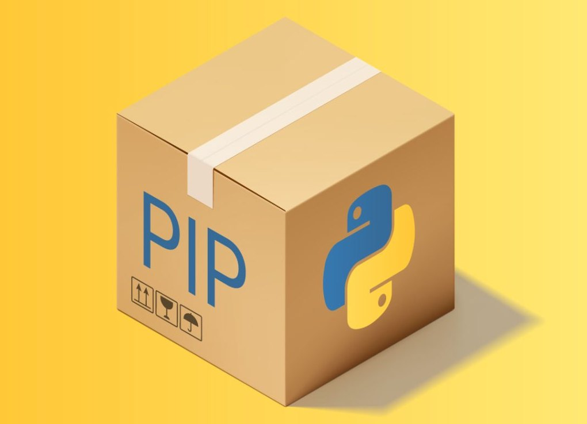
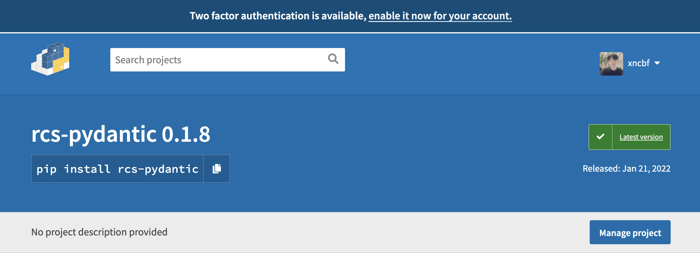
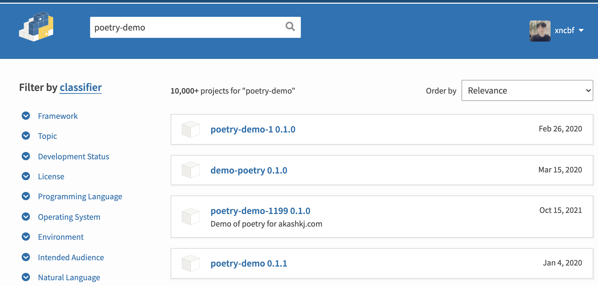
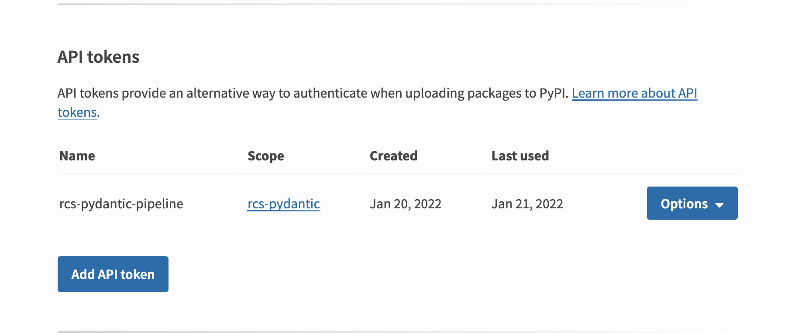
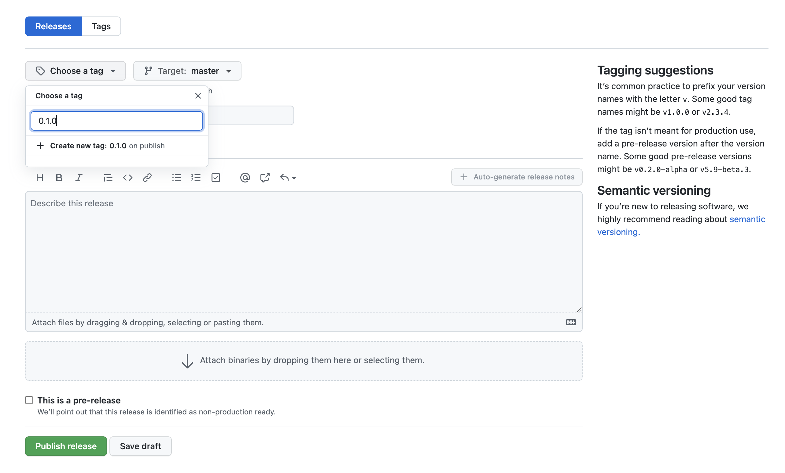
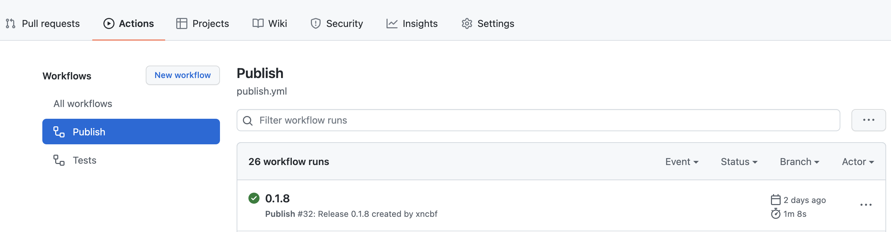

- [개요](#개요)
- [의존성 설치](#의존성-설치)
- [프로젝트 생성하기](#프로젝트-생성하기)
  - [(번외) pep518](#번외-pep518)
- [배포하기](#배포하기)
- [간단한 코드 작성](#간단한-코드-작성)
- [github action 자동 릴리즈](#github-action-자동-릴리즈)
  - [action file 작성](#action-file-작성)
  - [pypi 토큰 발행](#pypi-토큰-발행)
  - [릴리즈](#릴리즈)
- [마무리](#마무리)

## 개요

최근 python 패키지를 pypi 에 배포해본 경험을 공유하려고 합니다.

약간의 튜토리얼식으로 작성했으니 따라해보시는걸 추천해드립니다!

제가 배포한 패키지는 [rcs-pydantic](https://github.com/xncbf/rcs-pydantic) 입니다.

간단한 구조이니 튜토리얼을 따라하기 귀찮으시면 `fork` 받으셔서 이것저것 살펴보시면 되겠습니다.

## 의존성 설치

패키지 배포를 좀 더 간편하게 하기 위해서 `poetry` 를 설치해야 합니다

```sh
python -m pip install poetry
```

## 프로젝트 생성하기

다음 명령어를 통해서 프로젝트를 생성합니다.
프로젝트 이름은 임의로 poetry-demo 라고 정했습니다.

```sh
poetry new poetry-demo
```

다음과 같은 폴더구조가 생성됩니다.

```sh
poetry-demo
├── pyproject.toml
├── README.rst
├── poetry_demo
│   └── __init__.py
└── tests
    ├── __init__.py
    └── test_poetry_demo.py
```

함께 생성된 pyproject.toml 에는 [이전글](http://localhost:8000/python/%ED%9A%8C%EC%82%AC%EC%97%90%EC%84%9C-%EC%82%AC%EC%9A%A9%ED%95%98%EB%8A%94-python-%EC%BD%94%EB%93%9C-%EA%B4%80%EB%A6%AC%EC%9A%A9-%ED%95%84%EC%88%98-%EB%9D%BC%EC%9D%B4%EB%B8%8C%EB%9F%AC%EB%A6%AC/#%EC%8B%9C%EC%8A%A4%ED%85%9C-%EB%B9%8C%EB%93%9C-%EC%A2%85%EC%86%8D%EC%84%B1-%EA%B4%80%EB%A6%AC-pep518) 에서 설명했던 것처럼 시스템 요구사항이 포함되어 있습니다.

`pep518` 이 등장하기 전 생성되었던 패키지들은 대부분 `setup.py`, `setup.cfg` 에 정의되어있습니다.

### (번외) pep518

이제 poetry 에서는 [2021년 3월 1일에 최종적으로 승인](https://discuss.python.org/t/pep-621-round-3/5472/114)된 메타데이터에 관한 제안 [pep621](https://www.python.org/dev/peps/pep-0621/)과 [pep631](https://www.python.org/dev/peps/pep-0631/) 에 대한 [논의가 이루어지고 있습니다.](https://github.com/python-poetry/poetry/issues/3332)

아직 논의가 마무리 되지 않은 현재 시점에서 `pep621` 을 공식적으로 지원하는 파이썬 패키지 관리 툴은 [pdm](https://github.com/pdm-project/pdm) 과 [flit](https://github.com/pypa/flit) 이 있습니다.

우리는 `poetry` 를 사용할 것이지만 `flit` 에 대해서도 살펴 보는 것을 권장합니다.

`poetry` 가 `pep621` 를 공식적으로 지원하는지를 여기 [로드맵](https://github.com/python-poetry/roadmap/issues/3)에서 확인할 수 있습니다.

## 배포하기

배포하기 위해서는 [pypi.org](https://pypi.org/) 에 회원가입을 먼저 해야합니다.

회원가입후 이메일 인증까지 받으면! 이제 배포 준비가 완료되었습니다.

다음 명령어로 배포를 시작해보겠습니다.

```sh
poetry publish --build
```

아까 가입한 pypi 의 이름과 비밀번호를 입력하고 나면 다음과 같이 실제 pypi.org 패키지 서버에 배포된 것을 확인할 수 있을 것 입니다.



동일한 이름의 패키지 배포가 불가능하니 각자 프로젝트의 이름과 버전을 다르게 설정해주세요 🙃



> poetry-demo 이름으로 올라온 패키지가 만개 이상...😱

## 간단한 코드 작성

내가 올린 패키지를 import 해서 사용해보기 위해서 간단한 코드를 작성해보겠습니다.

패키지 이름이 poetry-demo 라는 가정하에, main.py 를 생성하면 다음과 같은 구조가 됩니다.

```sh
poetry-demo
├── pyproject.toml
├── README.rst
├── poetry_demo
│   ├── __init__.py
│   └── main.py     # 방금 생성한 파일
└── tests
    ├── __init__.py
    └── test_poetry_demo.py
```

main.py 에 간단한 코드를 작성해보겠습니다.

```py
def sum_a_and_b(a: int, b: int) -> int:
    return a + b
```

지금과 같이 배포하면 다른 프로젝트에서 내 코드를 다음과 같이 사용할 수 있게 됩니다.

```py
from poetry_demo import main

main.sum_a_and_b(1,2)
```

그런데 지금껏 다른 프로젝트에서는 main 없이 `from poetry_demo import sum_a_and_b` 이런식으로 사용하셨을겁니다.

이렇게 만들도록 하기 위해서 `__init__.py` 에 다음과 같이 작성합니다.

```py
# flake8: noqa
from .main import *

__all__ = [
    "sum_a_and_b",
]

__version__ = "0.1.0"
```

이제 다음과 같이 사용할 수 있게 되었습니다.

```py
from poetry_demo import sum_a_and_b

sum_a_and_b(1,2)
```

## github action 자동 릴리즈

이제 파이썬 패키지를 손수 배포해봤으니 github action 을 통해서 자동으로 릴리즈 해보도록 하겠습니다.

### action file 작성

다음과 같이 publish.yml 파일을 생성합니다.

```sh
poetry-demo
├── .github
│   └── workflows
│       └── publish.yml  # 방금 생성한 파일
├── pyproject.toml
├── README.rst
├── poetry_demo
│   ├── __init__.py
│   └── main.py
└── tests
    ├── __init__.py
    └── test_poetry_demo.py
```

publish.yml 파일을 다음과 같이 작성합니다.

```yml
name: Publish

on:
  release:
    types:
      - created

jobs:
  publish:
    runs-on: ubuntu-latest
    steps:
      - name: Dump GitHub context
        env:
          GITHUB_CONTEXT: ${{ toJson(github) }}
        run: echo "$GITHUB_CONTEXT"
      - uses: actions/checkout@v2
      - name: Set up Python
        uses: actions/setup-python@v2
        with:
          python-version: '3.7'
      - uses: actions/cache@v2
        id: cache
        with:
          path: ${{ env.pythonLocation }}
          key: ${{ runner.os }}-python-${{ env.pythonLocation }}-${{ hashFiles('pyproject.toml') }}-publish
      - name: Install poetry
        if: steps.cache.outputs.cache-hit != 'true'
        run: pip install poetry
      - name: Install Dependencies
        if: steps.cache.outputs.cache-hit != 'true'
        run: poetry install
      - name: Publish
        env:
          POETRY_PYPI_TOKEN_PYPI: ${{ secrets.PYPI_TOKEN }}
        run: bash scripts/publish.sh
      - name: Dump GitHub context
        env:
          GITHUB_CONTEXT: ${{ toJson(github) }}
        run: echo "$GITHUB_CONTEXT"
```

### pypi 토큰 발행

pypi 에 토큰으로 배포하기 위해서 토큰 발행이 필요합니다.

<https://pypi.org/manage/account/> 에 방문해서 `Add API token` 버튼을 눌러서 토큰을 발행하면 다음과 같이 토큰이 생성됩니다.



이제 github repository `settings > Secrets > New repository secret` 에 들어가서 발급받은 키를 `PYPI_TOKEN` 값에 작성해줍니다.

이제 준비가 모두 끝났습니다

### 릴리즈

본인의 레파지토리 주소 github.com/username/repo-name 에 들어가서 새로운 릴리즈를 생성할 수 있습니다.

아래처럼 Create a new release 를 누릅니다.


다음과 같이 프로젝트에서 사용한 태그를 입력하고 엔터를 누르면 새로운 태그가 생성됩니다.



릴리즈 타이틀을 입력하고 publish release 를 하면 새로운 액션이 생성되며 동작하게 됩니다.



동작이 완료되면 <https://pypi.org> 에서 본인이 생성한 패키지를 찾을수 있고 `pip install` 을 통해서 다운로드 할 수 있습니다.

## 마무리

지금까지는 남이 올려놓은 오픈소스만 사용하다가 처음으로 내가 만든 오픈소스를 배포해보았습니다.

생각보다 간단했고, 내가 자주 사용하던 오픈소스들도 생각보다 어렵게 구현되지 않은 경우가 대부분이었습니다.

오픈소스에 기여한다는것이 멀고 어렵게 느껴졌었지만 이렇게 한발 더 다가가게 되었습니다.

여러분도 자신만의 패키지를 배포해서 오픈소스에 한발 더 다가가 보는건 어떨까요?
