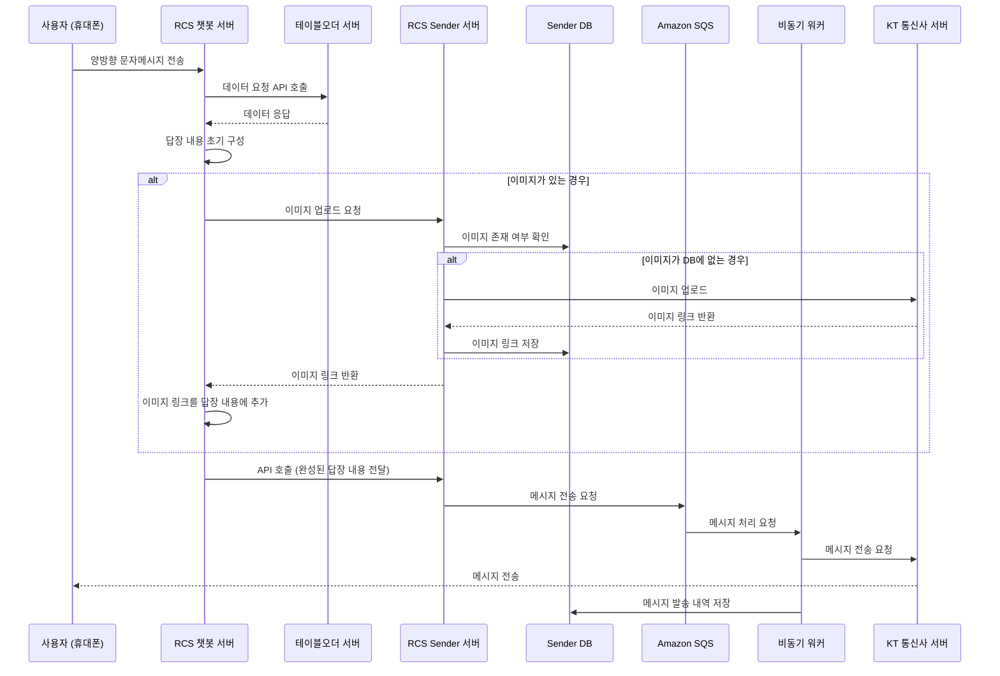

- [개요](#개요)
- [요구사항](#요구사항)
- [서비스 다이어그램](#서비스-다이어그램)
- [구현 내용](#구현-내용)

## 개요

본 포스트는 본인이 RCS 메시징 서비스 프로젝트를 진행하면서 구현한 내용을 정리한 것이다.

## 요구사항

1. RCS 챗봇 서버에서 사용자로부터 받은 메세지를 가공해서 응답을 보내는 서비스를 구현한다.
2. 캠페인 메세지 대량 발송을 위해 비동기 메시지 전송 서비스를 구현한다.
3. 발송량(TPS)을 고려한 확장성 있는 서비스를 구현한다.

## 서비스 다이어그램

## 구현 내용

