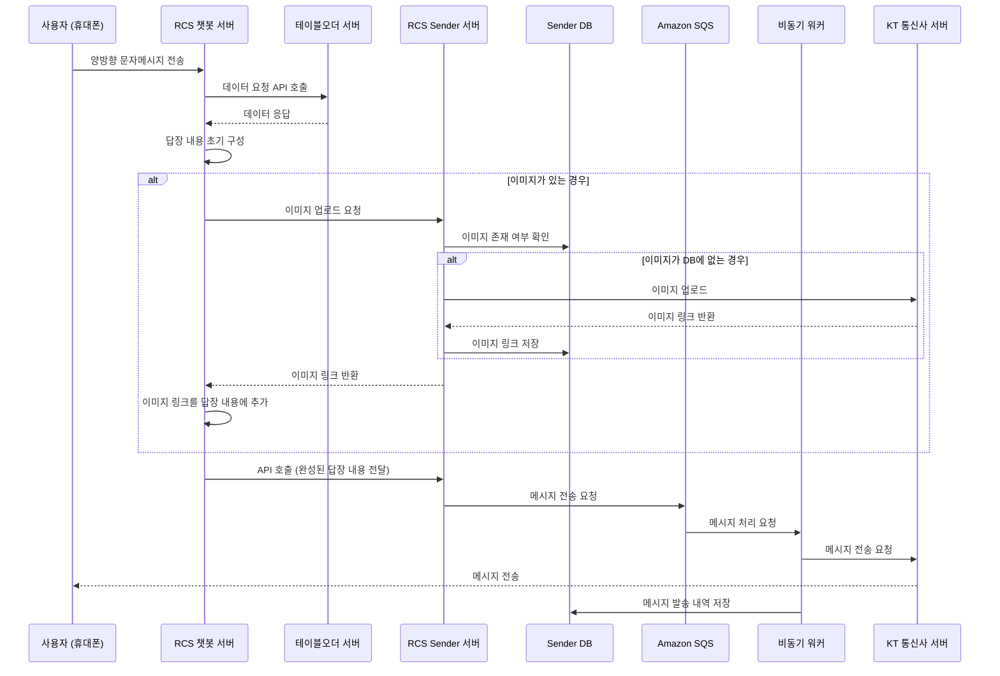

- [개요](#개요)
- [요구사항](#요구사항)
- [서비스 다이어그램](#서비스-다이어그램)
- [구현 내용](#구현-내용)
- [이슈와 대응](#이슈와-대응)
  - [속도 이슈](#속도-이슈)
  - [메세지 중복 발송 이슈](#메세지-중복-발송-이슈)
  - [기타 이슈](#기타-이슈)
- [결론](#결론)

## 개요

본 포스트는 본인이 RCS 메시징 서비스 프로젝트를 진행하면서 구현한 내용을 정리한 것이다.

## 요구사항

1. RCS 챗봇 서버에서 사용자로부터 받은 메세지를 가공해서 응답을 보내는 서비스를 구현한다.
2. 캠페인 메세지 대량 발송을 위해 비동기 메시지 전송 서비스를 구현한다.
3. 발송량을 고려한 확장성 있는 서비스를 구현한다.

## 서비스 다이어그램

> 오더홉 = 테이블오더

## 구현 내용
서버 구성과 흐름은 위 다이어그램에서 설명한 것과 같다. 

- RCS 챗봇 서버: 사용자로부터 받은 메세지를 가공해서 응답을 보내는 서비스
- 테이블오더 서버: 캠페인 메세지 대량 발송을 위한 데이터 제공 서버
- RCS Sender 서버: 비동기 메시지 전송 서비스
- Amazon SQS: 메시지 전송 큐
- 비동기 워커: SQS에서 메시지를 가져와서 전송하는 서비스
- KT 통신사 서버: 메시지 발송 서버

서버는 모두 AWS EKS 위에서 동작하며, 서비스는 모두 도커 컨테이너로 구성되어 있다. 

데이터 구조는 [rcs-pydantic](https://github.com/xncbf/rcs-pydantic) 라이브러리를 개발하여 Pydantic 모델로 정의하고, rcs 챗봇서비스와 발송 서비스에서 공통으로 사용하도록 하였다.

## 이슈와 대응

### 속도 이슈
캠페인 메세지 대량 발송시 특정 기업에서 한번에 수십만개의 메세지를 발송해야하는 경우가 발생했다.

당시 발송 가능한 메세지 수는 분당 1,200개로 제한되어 있었으며, 이를 해결하기 위해 다음과 같은 방법을 사용하였다.

1. 비동기 워커 수평 확장: 비동기 워커를 여러 대로 늘려서 발송 요청을 병렬로 처리하도록 하였다.
2. SQS 를 fifo 에서 standard 로 변경: 발송량을 늘리기 위해 fifo 대신 standard queue 를 사용하였다.

이를 통해 통신사에서 수용 가능한 최대 발송량인 분당 12,000개의 메세지 발송이 가능하도록 개선하였다.

### 메세지 중복 발송 이슈

fifo 에서 standard 로 변경하면서 발생한 이슈로, fifo 에서 기능적으로 막아주던 메세지 중복 발송이 발생하였다.

그에 따라 캠페인 발송시 캠페인에 부여되는 고유 ID 와 유저의 전화번호를 조합하고 uuid5 로 해시하여 유저별 고유한 메세지 ID 를 생성하였다.

메세지를 발송할 때 이 메세지 ID 를 함께 전송하고, 발송 전에 이 메세지 ID 가 발송 내역에 있는지 확인하여 중복 발송을 막았다.

### 기타 이슈

캠페인 메세지를 대량으로 발송할 때 단건 발송이 딜레이되는 현상이 발생하였다.

캠페인 메세지가 단번에 큐에 대량으로 쌓이면서, 단건 발송은 후순위로 밀려나기 때문에 발생하는 현상이었다.

이를 해결하기 위해 캠페인용 큐와 단건용 큐를 분리하였고, 단건 발송은 즉시 처리되도록 하였다.

## 결론

RCS 메세지 서비스를 구현하면서 발생한 이슈들을 해결하고, 확장성 있는 서비스를 구현하였다.

이를 통해 사용자에게 빠르고 안정적인 RCS 메세지 서비스를 제공할 수 있었으며, 향후 발생할 이슈에 대한 대응력을 높일 수 있었다.
