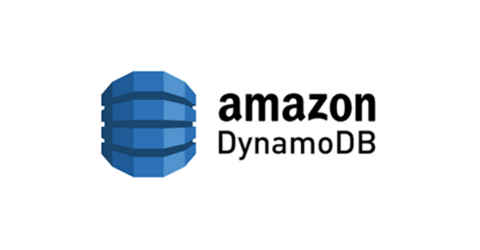
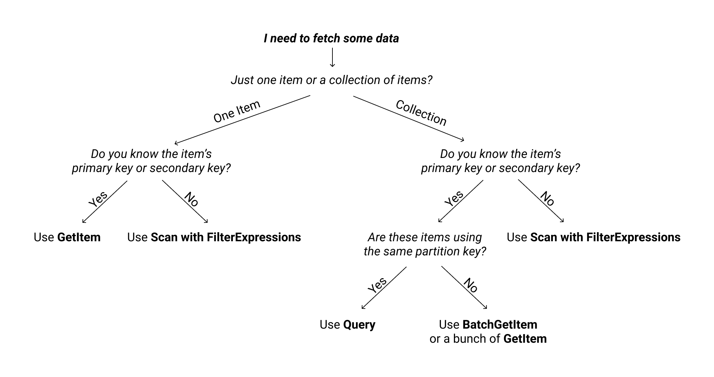

- [TL;DR](#tldr)
- [개요](#개요)
- [Scan vs Query](#scan-vs-query)
  - [Scan](#scan)
  - [Query](#query)
- [어떨 때 Scan 을 쓰고 어떨 때 Query 를 쓰나요?](#어떨-때-scan-을-쓰고-어떨-때-query-를-쓰나요)
  - [검색하고자 하는 값이 한개인 경우](#검색하고자-하는-값이-한개인-경우)
  - [검색하고자 하는 값이 여러개인 경우](#검색하고자-하는-값이-여러개인-경우)
- [(번외) index](#번외-index)
  - [로컬 보조 인덱스(LSI)](#로컬-보조-인덱스lsi)
  - [글로벌 보조 인덱스(GSI)](#글로벌-보조-인덱스gsi)
- [마무리](#마무리)

## TL;DR

가능한 `Scan` 보단 `Query` 를 쓰세요!

## 개요

최근 개인적으로 팀을 이뤄 진행하고있는 사이드 프로젝트에서 1:1 채팅방 구현을 하기 위해 `DynamoDB` 를 사용할 일이 있었습니다.

DynamoDB를 사용하면서 알게 된 정보들을 공유하려고 합니다.

## Scan vs Query

먼저 `Scan`과 `Query`의 차이에 대해 알아보겠습니다.

두 기능 모두 컬렉션 item 을 가져오기 위한 `aws cli` 의 한 기능으로 비슷한 목적을 수행하지만 어떤 기능을 사용하느냐에 따라 매우 큰 성능 차이가 발생할 수 있습니다.

### Scan

`Scan` 은 값과 일치하는 요소를 찾기 위해 전체 테이블을 풀스캔합니다. 저장된 데이터가 많다면 몇 시간이 걸릴 수도 있습니다.

### Query

`Query`는 `pk` 또는 보조 파티션/해시 키 를 기반으로 선택한 파티션에 대한 직접 조회를 수행합니다.

`index` 가 설정된 필드만 `Query` 가 가능합니다.

## 어떨 때 Scan 을 쓰고 어떨 때 Query 를 쓰나요?

일반적으로 스캔보다 쿼리를 사용해야합니다.

Scan 을 사용하는 경우는 다음 이미지와 같이 정의가 가능합니다.

### 검색하고자 하는 값이 한개인 경우

- 해당 아이템의 index 값을 알고있나요?
  - 안다: `GetItem`
  - 모른다: `Scan`

### 검색하고자 하는 값이 여러개인 경우

- 해당 아이템의 index 값을 모른다: `Scan`
- index 를 알고 해당 아이템 파티션키의 값이 같나요?
  - 같다: `Query`
  - 다르다: `BatchGetItem` or `GetItem` 여러번 호출

하지만 사용자에 의해 호출되는 api 에서는 `Scan` 이 발생되는 상황은 없어야 합니다.

`index` 값을 모르는데 검색해야 하는 상황이 발생하면 당장 `index` 를 걸어서 모르는 상황이 없게 해야 합니다.

## (번외) index

DynamoDB 의 인덱스 종류는 다음과 같습니다.

### 로컬 보조 인덱스(LSI)

- 로컬 보조 인덱스는 테이블을 처음 생성할 때 지정해야합니다.
- 최대 5개의 인덱스를 생성할 수 있습니다.
- 키당 데이터는 `10GB` 로 제한됩니다.
- 기본 테이블과 처리량을 공유합니다.

### 글로벌 보조 인덱스(GSI)

- 키당 데이터 용량 제한이 없습니다.
- 테이블이 생성된 후 생성, 변경할 수 있습니다.
- 최대 20개의 인덱스를 생성할 수 있습니다.
- GSI 에는 별도 비용이 발생합니다.
- (모든 속성이 프로젝션된) 여러개의 글로벌 보조 인덱스를 사용하는 경우 값이 업데이트 될 때 비동기적으로 다른 GSI에 전파되기때문에 다른 필드를 기반으로 쿼리할 때 최신 데이터가 나오지 않을 수 있습니다.

## 마무리

초당 트랜젝션 수가 중요한 실시간 채팅을 구현하기 위해 I/O 속도가 빠르고 확장성이 있는 `DynamoDB` 를 사용하게 되었습니다.

메세지를 읽어오기 위한 코드를 작성하다가 `Query` 와 `Scan` 의 차이에 대해 궁금증이 생겨서 알아보았습니다.

결국 관계형 데이터베이스에서 테이블을 생성할 때 `index` 를 고려해야 한다는 점과 별반 다르지 않았지만 `DynamoDB` 에서만 존재하는 `index` 의 종류와 특징에 대해 살펴보는 계기가 되었습니다.
