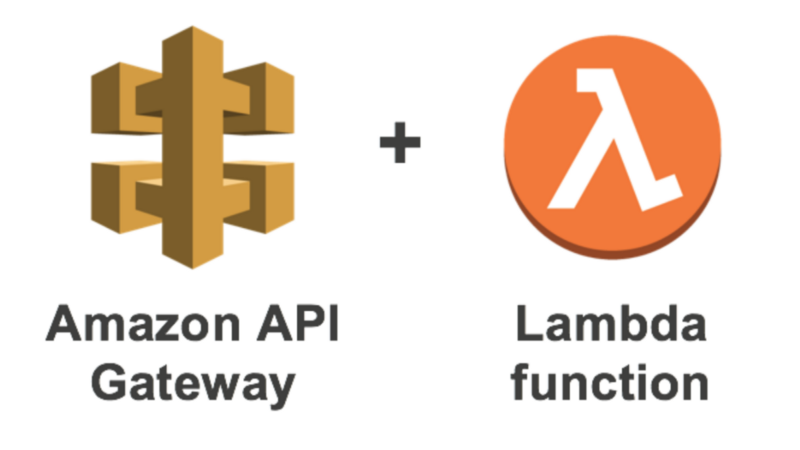
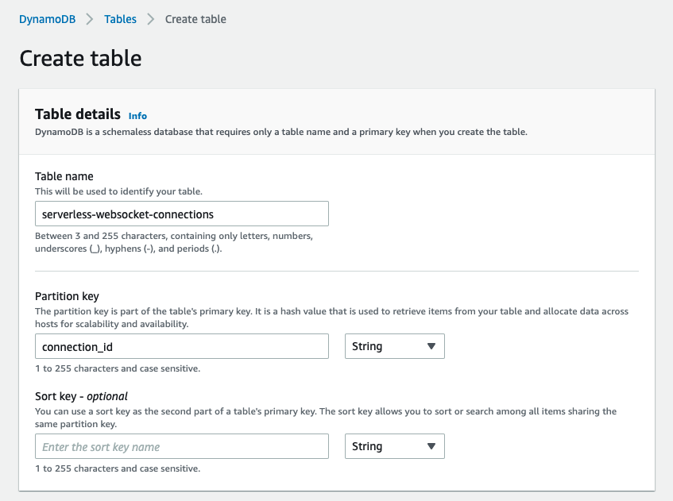

## 웹소켓 서버를 serverless 환경으로 선택하는 이유

> 절대 서버리스를 silver bullet 으로 생각하지 말자. 여러가지 선택지 중 한 가지일 뿐이다.  
> 트래픽이 일정수준 이상이 되면 온프레미스 서버를 사용하는것이 저렴하다.

[aws 에서 2018년 12월에 api gateway 용 websocket protocol을 공개했다.](https://aws.amazon.com/ko/blogs/compute/announcing-websocket-apis-in-amazon-api-gateway/)  
나는 스타트업에서 일하고 있으며 내가 처한 상황과 완전히 들어맞는다고 생각해서 서버리스 환경을 선택했다.  
서버리스 도입을 고민하고있다면 다음 체크리스트에 모두 해당하는지 확인하고 도입하도록 하자.

- [x] 트래픽이 예측 불가능하거나 무의미한정도로 트래픽이 없다
- [x] 시스템 장애에 대응할 관리할 인원이 적거나 없다
- [x] 위 사항에 모두 해당하고 보다 저렴하게 사용하고싶다

## 사전 준비사항

시작하기에 앞서 serverless websocket 을 구성하기 위해 몇가지 준비가 필요하다.  
아래 순서는 이 포스트에서 설명하지 않을 예정이다.

1. aws 계정생성하기
2. iam access key 생성하기
3. node, npm, python3.9, pipenv 설치

## 의존성 요구사항

serverless websocket 을 배포하기 위해서는 다음과 같은 의존성 설치가 필요하다.  
설치 방법은 아래에 따로 설명할 예정이니 그냥 슥 보고 넘어가자.

- [serverless](https://github.com/serverless/serverless)
- [serverless-python-requirements](https://github.com/serverless/serverless-python-requirements)

## aws credentials 설정

`~/.aws/credentials` 파일에 iam 에서 설정한 access key를 다음과 같이 적어준다.

```zsh
[default]
aws_access_key_id = <YOUR_ACCESS_KEY>
aws_secret_access_key = <YOUR_SECRET_KEY>
```

## 프로젝트 폴더 생성, 의존성 설치

프로젝트 폴더를 생성한다.

```zsh
mkdir serverless-websocket-tutorial
cd serverless-websocket-tutorial
```

pipenv 를 이용해서 가상환경을 생성한다.
다른 프로젝트와 의존성관리를 별도로 하기 위해서 필요한 절차이다.

```zsh
pipenv --python 3.9
pipenv shell
```

aws 에 배포를 위해 `serverless` 를 설치한다.

```zsh
sudo npm install -g serverless
```

## 간단한 ping 함수 배포

`serverless.yml` 파일을 생성하고 다음과 같이 작성한다.

```yml
service: serverless-websocket

provider:
  name: aws
  runtime: python3.9
  lambdaHashingVersion: '20201221'
  region: ap-northeast-2

  ping:
    handler: handler.ping
    events:
      - http:
          path: ping
          method: get
```

`handler.py` 파일을 생성하고 다음과 같이 작성한다.

```python
def ping(event, context):
    response = {
        "statusCode": 200,
        "body": "PONG!"
    }
    return response
```

이제 간단한 ping 함수를 배포할 준비가 되었다.  
앱을 배포해보겠다.

```zsh
serverless deploy
```

아래처럼 콘솔에 표시될것이다

```zsh
Serverless: Running ...
Serverless: Packaging service...
Serverless: Excluding development dependencies...
Serverless: Injecting required Python packages to package...
Serverless: Uploading CloudFormation file to S3...
Serverless: Uploading artifacts...
Serverless: Uploading service serverless-websocket.zip file to S3 (9.76 MB)...
Serverless: Validating template...
Serverless: Updating Stack...
Serverless: Checking Stack update progress...
......................................
Serverless: Stack update finished...
Service Information
service: serverless-websocket
stage: dev
region: ap-northeast-2
stack: serverless-websocket-dev
resources: 5
api keys:
  None
endpoints:
  GET - https://{{your-host}}.execute-api.ap-northeast-2.amazonaws.com/dev/ping
functions:
  ping: serverless-websocket-dev-ping
layers:
  None
Serverless: Removing old service artifacts from S3...
```

위에 표시된 endpoints 를 웹에서 접근하면 `PONG!` 이라는 글자를 볼 수 있다.

```zsh
curl https://{{your-host}}.execute-api.ap-northeast-2.amazonaws.com/dev/ping
PONG!
```

이제 본격적으로 websocket 을 만들어 보겠다.

## 커넥션을 관리할 Database

웹소켓이 제대로 동작하기 위해서는 pub/sub 역할을 하는 `function` 과 수신자 정보를 보관할 `저장소`가 필요하다.  
저장소는 serverless 를 사용하는 목적에 걸맞게 `dynamodb` 를 사용할 예정이다.

`serverless-websocket-connections` 라는 이름의 table 을 생성한다.



아래 Settings 에 `on-demand`와 `provisioned` 를 선택하는 항목이 있는데 지금은 아무거나 선택해도 무방하다.  
나중에 아래 글을 읽어보고 스스로 결정하도록 하자.  
[DynamoDB On-Demand: When, why and how to use it in your serverless applications](https://www.serverless.com/blog/dynamodb-on-demand-serverless)  
지금은 Default settings 를 선택하고 넘어가도록 한다.

`dynamodb` 를 읽어올 권한을 위해 `serverless.yml` 파일에 권한 설정을 한다.

```yml
service: serverless-websocket

provider:
  name: aws
  runtime: python3.9
  lambdaHashingVersion: '20201221'
  region: ap-northeast-2

  iamRoleStatements:
    - Effect: 'Allow'
      Action:
        - 'dynamodb:PutItem'
        - 'dynamodb:GetItem'
        - 'dynamodb:UpdateItem'
        - 'dynamodb:DeleteItem'
        - 'dynamodb:BatchGetItem'
        - 'dynamodb:BatchWriteItem'
        - 'dynamodb:Scan'
        - 'dynamodb:Query'
      Resource:
        - 'arn:aws:dynamodb:ap-northeast-2:*:*'

  ping:
    handler: handler.ping
    events:
      - http:
          path: ping
          method: get
```

python 에서 사용할 의존성 을 위해 serverless plugin 을 설치한다.

```zsh
serverless plugin install -n serverless-python-requirements
```

serverless.yml 맨 아래에 다음줄을 추가한다.

```zsh
plugins:
  - serverless-python-requirements
```

pipenv 로 boto3 를 설치한다.

```zsh
pipenv install boto3
```

이제 프로젝트내에는 다음 파일들이 있어야한다.

```zsh
handler.py
node_modules/
package-lock.json
package.json
pipfile
pipfile.lock
serverless.yml
```

## Websocket connection function 작성

이제 모든 준비가 끝났다.  
소켓이 연결하고 끊길때 작동하는 함수를 작성해보겠다.  
handler.py 에 다음을 추가해준다.

```python
import logger
logger = logging.getLogger("handler_logger")
logger.setLevel(logging.DEBUG)

def connection_manager(event, context):
    connection_id = event["requestContext"].get("connectionId")

    if event["requestContext"]["eventType"] == "CONNECT":
        logger.info("Connect requested")
        # connection_id 를 생성한다.
        table = dynamodb.Table("serverless-websocket-connections")
        table.put_item(Item={"connection_id": connection_id})
        return {"statusCode": 200, "body": "Connect successful."}

    elif event["requestContext"]["eventType"] == "DISCONNECT":
        logger.info("Disconnect requested")
        # connection_id 를 삭제한다.
        table = dynamodb.Table("serverless-websocket-connections")
        table.delete_item(Key={"connection_id": connection_id})
        return {"statusCode": 200, "body": "Disconnect successful."}
```

websocket 연결을 허용하기 위해 serverless.yml 에 다음을 추가해준다.

```yml
provider:
  ...
  iamRoleStatements:
    - Effect: "Allow"
      Action:
        - "execute-api:ManageConnections"
      Resource:
        - "arn:aws:execute-api:*:*:**/@connections/*"

```

그리고 websocket 라우팅을 위해 다음 또한 추가해준다.

```yml
functions:
  connectionManager:
    handler: src.handler.connection_manager
    events:
      - websocket:
          route: $connect
      - websocket:
          route: $disconnect
  defaultMessage:
    handler: handler.default_message
    events:
      - websocket:
          route: $default
```

`$default` 은 아무 액션이 없을때 동작하는 예약된 경로이다.  
default message 처리를 위해 다음을 `handler.py` 에 추가한다.

```python
def default_message(event, context):
    logger.info("Unrecognized WebSocket action received.")
    return {"statusCode": 400, "body": "Unrecognized WebSocket action."}
```
