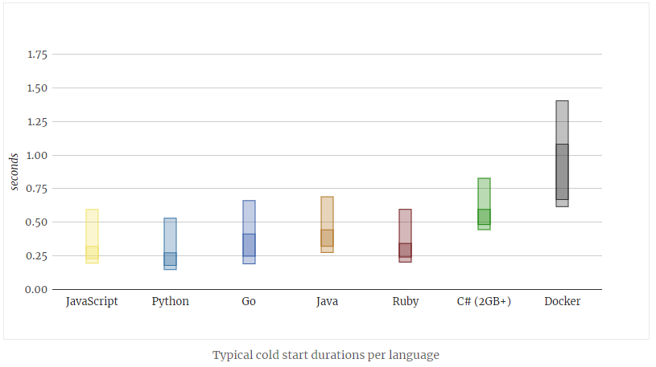
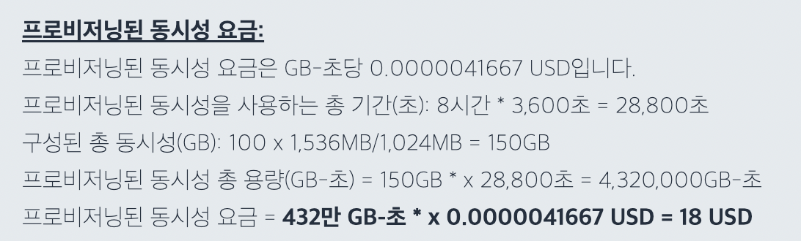
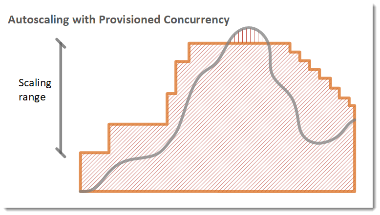
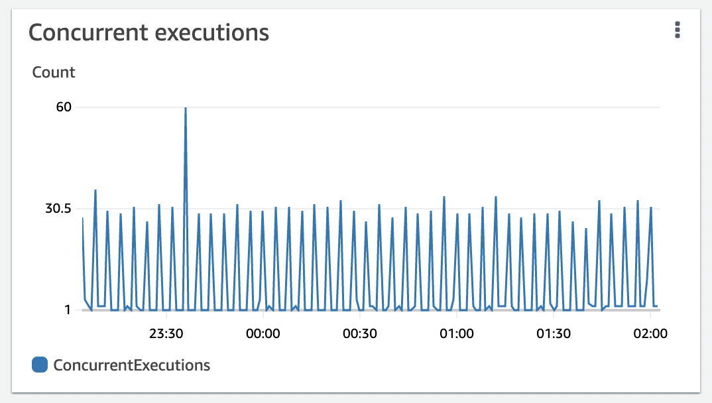

- [개요](#개요)
- [프로비저닝된 동시성](#프로비저닝된-동시성)
- [프로비저닝 오토스케일](#프로비저닝-오토스케일)
- [프로비저닝 되지 않은 동시성 높이기](#프로비저닝-되지-않은-동시성-높이기)
  - [zappa keep warm](#zappa-keep-warm)
  - [꼼수](#꼼수)
- [마무리](#마무리)

## 개요

나는 요즘 zappa, serverless 등 wsgi 를 지원하는 프레임워크를 사용해서 api 서버를 자주 구성한다.

그 이유는 상대적으로 저렴한 비용때문인데 사용량에 따라 비용이 책정되기때문에 왠만큼 사용자가 들어오지 않는 서비스는 그야말로 무료에 가까운 비용을 내고 서비스하고있다.

그런데 aws 에서 제공하는 lambda 와 api gateway 를 사용해서 serverless 스택으로 서버를 구성해서 사용하다보면 항상 발생하는 문제가 있다.

바로 coldstart 이슈이다.

순수 파이썬 또는 js 를 사용해서 완전히 기본적인 핸들러 구성을 하면 콜드스타트가 다음 그래프에서 나온것과 같이 길어봐야 1~2초정도이지만, django나 fastapi 같은 웹서버 프레임워크라도 띄우는 경우에는 8초 이상의 콜드 스타트를 경험하게 된다.



사용자의 입장에서 사이트가 로드되는데 1초 이상 걸리면 "느리다" 라고 생각하게 되는데 8초 정도 걸리는 사이트는 서비스가 완전히 망했다고 생각할 수도 있다.

따라서 콜드스타트를 최대한 줄일 수 있도록 노력해야한다. 콜드스타트를 줄일수 있는 방법을 몇가지 소개하겠다.

## 프로비저닝된 동시성

가장 간단한 방법이다. lambda 설정 내에서 provisioned concurrency 를 올리면 된다.

이렇게 설정하게 되면 lambda의 동시성이 항상 유지되어 콜드스타트가 없는 빠른 api 를 제공할 수 있다.

하지만 사용량에 따라 금액을 측정하는 방식인 기본 lambda 과금체계와는 다르게 어마무시한 과금을 하는 설정이다.

다음은 aws 에서 설명하는 과금 계산방법이다.



1,536MB 의 메모리 용량으로 동시성 100을 8시간동안 구성했을 때 18달러가 과금 되는 것을 알 수 있다.

한달 내내 켜놓았을때 54달러 * 30일 = 1,620 달러가 과금된다.

그다지 비싸다고 느끼지 않을 수도 있지만 m6g.12xlarge ec2 인스턴스를 한달 켜놨을때와 거의 동일한 금액이다.

## 프로비저닝 오토스케일

사실은 이게 가장 정석적인 방법이다.

프로비저닝을 오토스케일해서 트래픽이 급증하는 시간대에 맞춰 프로비저닝을 오토스케일 할 수 있다.

이렇게 하면 하루종일 동시성을 동일하게 유지하는것보다는 훨씬 저렴한 가격이 된다.



## 프로비저닝 되지 않은 동시성 높이기

이 방법은 lambda 에서 공식적으로 소개된 방법이 아닌 꼼수이다.

### zappa keep warm

`zappa` 라이브러리에서 기본적으로 제공하는 `keep_warm` 옵션은 4분마다 한번씩 빈 lambda 함수를 호출해서 lambda 를 warm up 상태로 만들어준다.

동시성이 생긴지 5분이 지나면 cold 상태가 되기 때문에 4분마다 호출 시키는 것이다.

하지만 이 방법은 동시성을 1로 유지시켜 주는 방법이고 우리는 더 많은 동시성이 필요할 수 있다.

### 꼼수

나는 두가지 메서드를 만들었다.

하나는 zappa task 데코레이션을 이용한 비동기 task 메서드이고

```python
@task
def keep_concurrency():
    time.sleep(0.1)
```

다음 하나는 앞의 메서드를 호출하는 스케줄링된 메서드이다.

```python
def invoke_keep_concurrency():
    for _ in range(20):
        keep_concurrency()
```

sleep 으로 동작중인 상태로 만들어놓고 비동기로 동시에 여러번 호출하면 동시성이 올라간다.

나는 `invoke_keep_concurrency` 메서드를 스케줄러에 5개 등록해서 다음과 같이 동시에 5번 호출하도록 했으니 sleep 을 잘 조절하면 최대 100의 동시성을 얻을 수 있다.

```json
# zappa_settings.json
{
    "function": "core.tasks.invoke_keep_concurrency",
    "expression": "rate(4 minutes)"
},
{
    "function": "core.tasks.invoke_keep_concurrency",
    "expression": "rate(4 minutes)"
},
{
    "function": "core.tasks.invoke_keep_concurrency",
    "expression": "rate(4 minutes)"
},
{
    "function": "core.tasks.invoke_keep_concurrency",
    "expression": "rate(4 minutes)"
},
{
    "function": "core.tasks.invoke_keep_concurrency",
    "expression": "rate(4 minutes)"
}
```

하지만 sleep 을 너무 높게 조정하면 4분마다 콜드스타트를 경험하는 유저가 생길 가능성이 높아지니 적절히 조정하도록 하자.

나는 sleep(0.1) 을 유지했을 때 대략 30정도로 유지되고있다.



4분에 100개씩 호출한다고 하더라도 한달에 10,800 번밖에 호출되지 않는다 금액으로 따지자면 `3,072MB` 기준으로 `0.05 USD` (약 50 원) 정도이다.

## 마무리

안정성을 따지자면 당연히 프로비저닝된 동시성 오토스케일 기능을 사용하는것이 바람직하다. 하지만 주기적으로 함수를 호출해서 동시성을 높이는 방법으로도 왠만큼 높은 동시성을 유지할 수 있다.

여러가지 방법으로 콜드 스타트를 피해보자.
