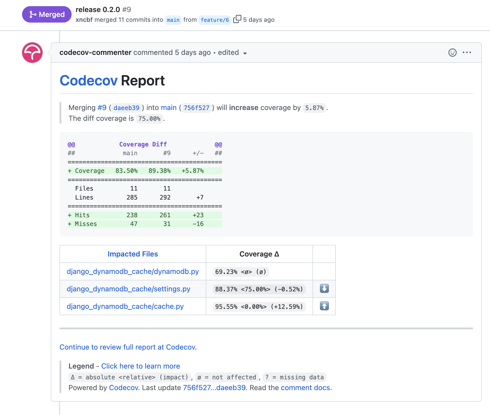

- [개요](#개요)
- [여러 환경이라는게 뭐에요?](#여러-환경이라는게-뭐에요)
- [왜 tox 를 사용하나요?](#왜-tox-를-사용하나요)
- [따라하기](#따라하기)
  - [전제 조건](#전제-조건)
  - [tox 환경설정](#tox-환경설정)
  - [github action 설정](#github-action-설정)
- [마무리](#마무리)

## 개요

오늘은 [이전 글](https://pypy.dev/django/how-to-make-django-third-party-library/)에서 언급했던 여러 버전을 커버하는 라이브러리를 위한 테스팅 환경을 구성해보는 글을 쓰려고 합니다.

tox 를 사용해서 여러 환경을 테스팅을 하고 github action 을 통해 커버리지를 보여주는 방법까지 소개하겠습니다.

이 글은 [django-dynamodb-cache](https://github.com/xncbf/django-dynamodb-cache) 에서 사용한 방법을 기준으로 합니다.

## 여러 환경이라는게 뭐에요?

예를 들면 이런겁니다.

`Django rest framework` 는 현재 글 작성 시점에서 python(3.6, 3.7, 3.8, 3.9, 3.10) 버전, django(2.2, 3.0, 3.1, 3.2, 4.0) 버전을 지원합니다.

그럼 이 환경에서 모두 동작하는지 확인하려면 어떻게 해야할까요?

- python 3.6 - django 2.2  
- python 3.6 - django 3.0  
- python 3.6 - django 3.1  
- python 3.6 - django 3.2  
- python 3.7 - django 2.2  
- python 3.7 - django 3.0  
- python 3.7 - django 3.1  
- python 3.7 - django 3.2  
.....

이런식으로 단순히 생각하면 5 * 5 = 25 가지를 테스트해야 합니다 (django 가 지원하는 python 버전이 달라서 실제론 좀 더 적습니다.)

os 까지 커버한다면 macos, windows, linux 단순 3개만 해도 3 * 5 * 5 = 75가지입니다...

## 왜 tox 를 사용하나요?

우리가 지금까지 일반적으로 테스트하던 방법은 하나의 환경에서 테스트하기 때문에 특정 환경이 이미 구성되어 있어서 `pytest` 같은 단일 명령어로 테스트할 수 있었지만

위와 같은 여러 환경에서 테스트하려면 25가지 환경을 각자 구성하는것은 아주 번거로운 작업이 됩니다.

그래서 이러한 환경을 쉽게 테스트하기 위해 tox 를 사용합니다.

## 따라하기

### 전제 조건

- 저는 pytest를 테스팅 툴로 사용하고 poetry를 패키지 관리 툴로 사용합니다.
- python `3.8, 3.9, 3.10` 을 커버하고 django 버전 `3.0, 3.1, 3.2, 4.0` 을 커버합니다.
- CI 는 github action 을 사용합니다.
- codecov 환경이 구성되어 있습니다. (CODECOV_TOKEN 설정 필요)

### tox 환경설정

github action 에서 환경을 테스트하기 위해 [tox-gh-actions](https://github.com/ymyzk/tox-gh-actions)을 사용했습니다.

dev dependency 에 tox 를 추가합니다

```sh
poetry add tox --dev
```

`tox.ini` 을 다음과 같이 구성합니다.

```ini
[tox]
isolated_build = True                   ; 독립된 환경을 구성합니다.
envlist =
    py{38,39}-dj{30,31,32,40},          ; python3.8 과 3.9 에서는 django 3.0, 3.1, 3.2, 4.0 을 테스트합니다.
    py310-dj{32,40},                    ; python3.10 에서는 django 3.2, 4.0 을 테스트합니다.
skipsdist = true                        ; 패키징을 스킵합니다.

[tox:.package]
basepython = python3                    ; 기본 python 버전을 설정합니다.

[gh-actions]
python =
    3.8: py38                           ; github action 에서 사용할 python 환경 구성
    3.9: py39
    3.10: py310

[testenv]
allowlist_externals = poetry            ; poetry 환경을 사용하기 위한 설정
commands =                              ; 테스트하고, xml 로 리포트를 내보내고, coverage 파일을 합칩니다.
    pytest --cov=django_dynamodb_cache tests/ --cov-report=xml --cov-append

passenv = *                             ; tox 환경으로 복사할 환경변수 목록 (전체)
deps =                                  ; 디펜던시 목록들
    dj30: Django>=3.0,<3.1
    dj31: Django>=3.1,<3.2
    dj32: Django>=3.2,<3.3
    dj40: Django>=4.0a,<4.1
    djmaster: git+https://github.com/django/django
    pytest
    pytest-cov                          ; 커버리지를 확인하기 위해 필요합니다.
    moto
    boto3
    botocore

[testenv:clean]                         ; 커버리지 구성 설정
deps = coverage         
skip_install = true
commands = coverage erase
```

### github action 설정

tox 로 linting test, mypy test 한방에 할 수도 있지만 저는 github actions 에서 나누었습니다 (이렇게 하면 실패한 테스트만 돌리기 좋음)

아래 설정파일은 다음과 같은 과정을 거치고 있습니다.

- 린팅 테스트
  - python3.8 를 셋업합니다.
  - poetry 를 설치합니다.
  - [lint-test.sh](https://github.com/xncbf/django-dynamodb-cache/blob/main/scripts/lint-test.sh) 을 실행합니다
- 커버리지 테스트
  - 최대 동시성이 8인 파이썬 매트릭스 환경을 구성한다.
  - 각 파이썬 버전을 셋업한다.
  - tox 를 설치한다.
  - tox 명령어를 통해 테스트한다.
  - 커버리지 결과물을 codecov 에 올린다.

```yml
name: Tests
on:
  push:
    branches:
      - main
  pull_request:
    types: [opened, synchronize]
jobs:
  lint-test:
    runs-on: ubuntu-latest
    steps:
    - uses: actions/checkout@v1
    - name: Set up Python 3.8
      uses: actions/setup-python@v2
      with:
        python-version: 3.8
    - name: Install Poetry
      run: |
        python -m pip install poetry
    - name: Install dependencies
      run: |
        poetry install
    - name: Publish
      run: bash scripts/lint-test.sh
  test:
    runs-on: ubuntu-latest
    strategy:
      max-parallel: 8
      matrix:
        python-version: [3.8, 3.9, "3.10"]

    name: ${{ matrix.experimental && 'Django master [ok to fail]' || format('Python {0}', matrix.python-version) }}
    steps:
      - uses: actions/checkout@v2
      - name: Setup python
        uses: actions/setup-python@v2
        with:
          python-version: ${{ matrix.python-version }}
          architecture: x64

      - name: "Install Dependencies"
        run: pip install tox tox-gh-actions

      - name: "Run tests"
        run: |
          tox ${{ matrix.experimental && '-e py310-djmaster' || '' }}
        env:
          AWS_ACCESS_KEY_ID: ${{ secrets.AWS_ACCESS_KEY_ID }}
          AWS_SECRET_ACCESS_KEY: ${{ secrets.AWS_SECRET_ACCESS_KEY }}
          AWS_DEFAULT_REGION: ${{ secrets.AWS_REGION_NAME }}
      - uses: codecov/codecov-action@v2
        with:
          token: ${{ secrets.CODECOV_TOKEN }}
          files: coverage.xml
          fail_ci_if_error: true # optional (default = false)
          verbose: true # optional (default = false)
```

PR 을 올려서 action 을 실행했다면, 다음과 같이 자동으로 코멘트가 달립니다.



## 마무리

tox 환경구성을 설정해 보았습니다. 파이썬 라이브러리를 여러 환경에서 동시에 테스트하는것은 tox 만한게 없는 것 같습니다.

저도 아직 사용해 본지 1주일 밖에 안되어서 많은 기능에 대해 알지 못하지만 파이썬 오픈소스를 만들 때 꼭 필요한 것 중에 하나인듯 합니다.

오류가 있거나 궁금하신점이 있다면 댓글로 남겨주시면 답해드리겠습니다 😀

읽어주셔서 감사합니다.
