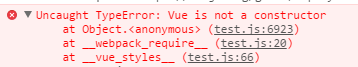

- [개요](#개요)
- [문제 확인](#문제-확인)
- [문제 발생 원인 찾기](#문제-발생-원인-찾기)
  - [잘못된 코드 배포?](#잘못된-코드-배포)
  - [문제 발생 재연](#문제-발생-재연)
- [해결 방안](#해결-방안)
- [교훈](#교훈)

## 개요

이번 글은 운영중인 POS 클라이언트에서 발생했던 에러와 해결 방법을 기록하기 위한 글입니다.

## 문제 확인

우리는 아직도 높은 비중을 차지하고있는 windows xp 를 사용하는 매장의 pc 를 지원하는 POS 클라이언트를 만들기 위해서 `nw.js` + `vue2` 의 조합을 사용하고 있었습니다.

어느 순간 부터 `vue` 의 객체를 사용하는 부분이 작동하지 않는 문제를 확인했습니다.

## 문제 발생 원인 찾기

### 잘못된 코드 배포?

우선 우리는 문제의 원인을 찾기 위해 마지막으로 POS 클라이언트가 배포되었던 시점을 확인했습니다.

자주 배포되기 어려운 클라이언트 특성상 새로운 기능이나 핫픽스 전에는 거의 배포하지 않고 있었기 때문에 마지막 배포가 2주 전이었던것을 확인했습니다.

따라서 잘못된 코드 배포는 원인이 아니었습니다.

### 문제 발생 재연

문제를 재연하기위해 로컬에서 클라이언트를 띄우고 개발자 도구를 열어서 에러메세지를 확인했습니다.

다음과 같은 에러메세지가 발생했습니다.



하지만 마지막 배포가 2주 전이었고,, 수정된 파일이 없는데 왜 에러가 나지? 라고 생각하는 찰나 며칠 전 읽었던 [블로그 글](https://yohanpro.com/posts/vue3/vue3-default)이 떠올랐습니다.

우리는 `Vue2` 를 사용하기 위해 `CDN` 에서 불러오는 코드를 사용하고 있었고, 얼마 전 `Vue`의 기본 `CDN` 버전이 `3`으로 바뀌면서 사용되는 문법이 달라서 동시에 에러가 발생했던 것 입니다.

다음과 같이 버전을 명시하지 않고 불러오고 있었습니다.

```html
<script src="https://cdn.jsdelivr.net/npm/vue"></script>
```

## 해결 방안

제가 읽은 블로그 글에서는 CDN 버전을 다음과 같이 명시하라고 조언하고 있습니다.

```html
<script src="https://cdn.jsdelivr.net/npm/vue@2"></script>
```

우리는 더 나아가서 클라이언트의 안정성과 Initialize 퍼포먼스를 위해 파일을 직접 다운받아 소스코드에 포함시키기로 결정 했습니다.

그리고 모든 지점이 클라이언트를 새로 설치해야하는 어마어마한 패널티를 가지게 되었습니다. 🥲

## 교훈

PC 프로그램에서 라이브러리를 사용할 때는 static 파일로 사용하자.

> PS. 문제 해결에 도움을 주신 [John](https://github.com/yohanpro)님과 [Anna](https://github.com/chaerin00)님께 감사드립니다 😊
