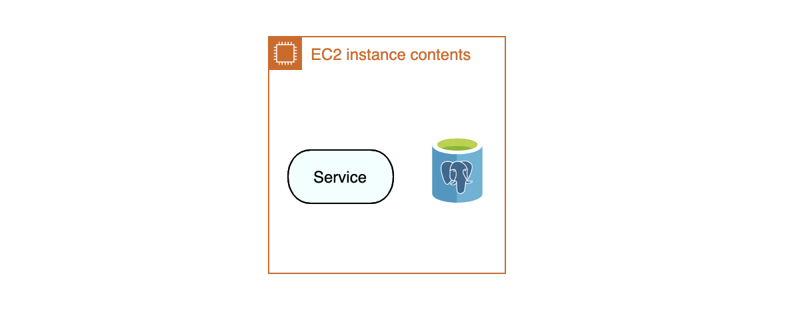
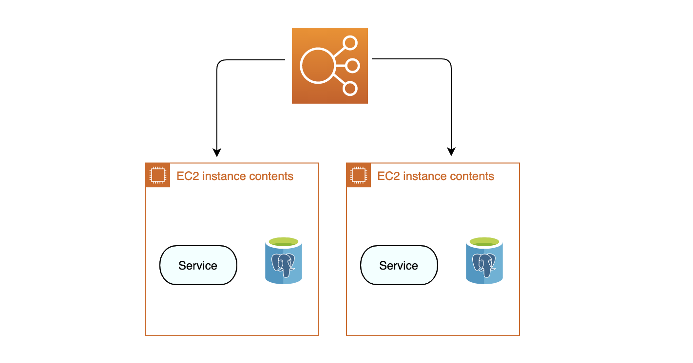
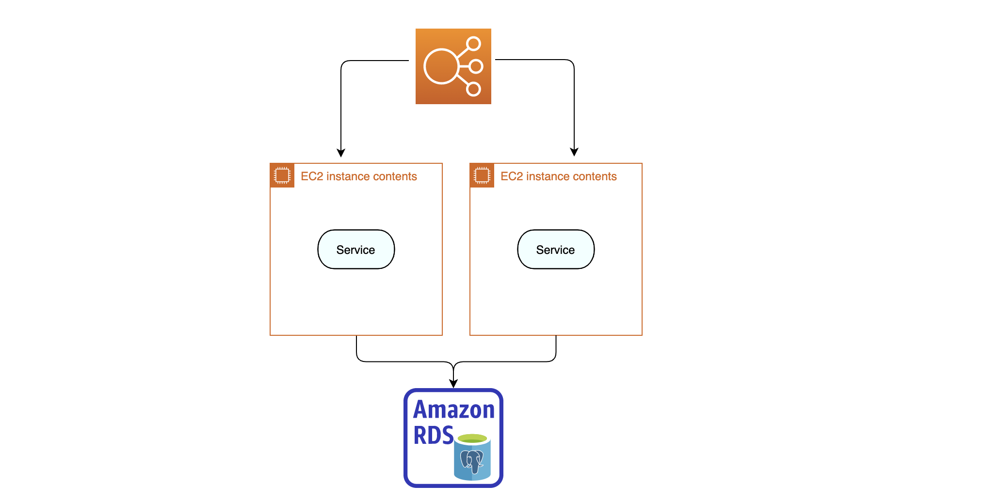
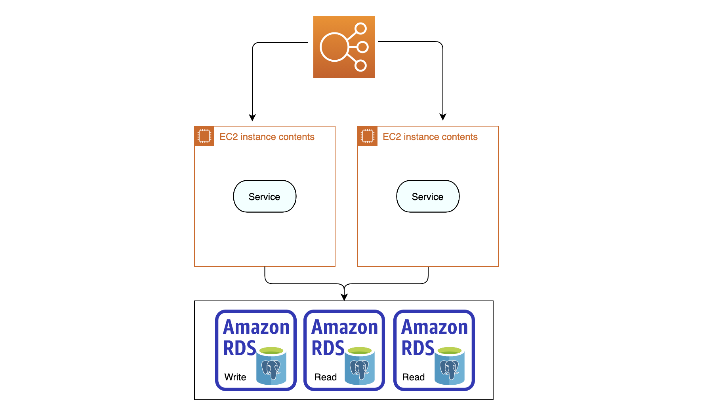
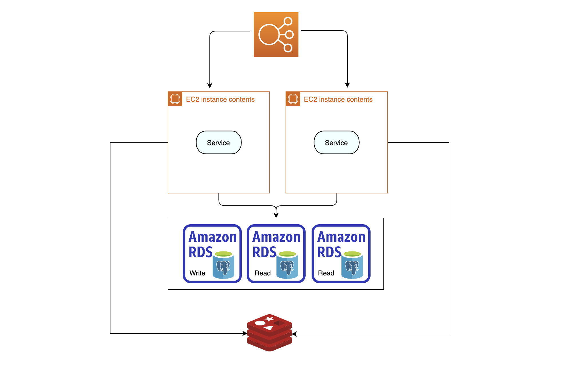
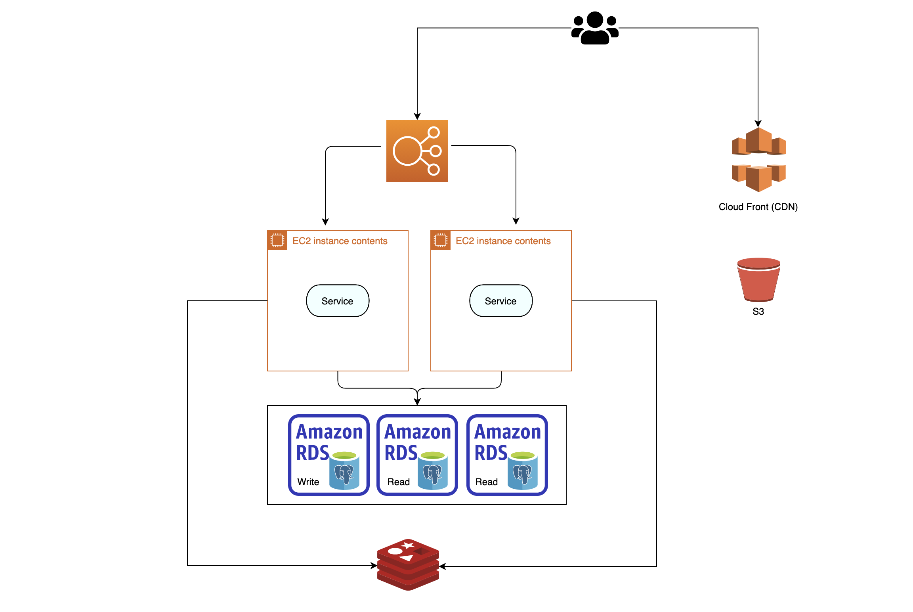
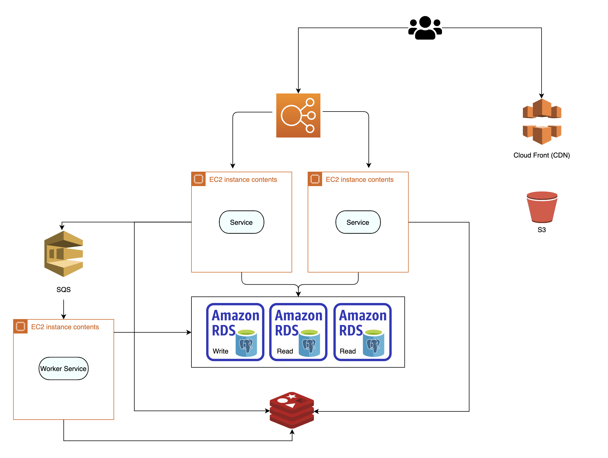
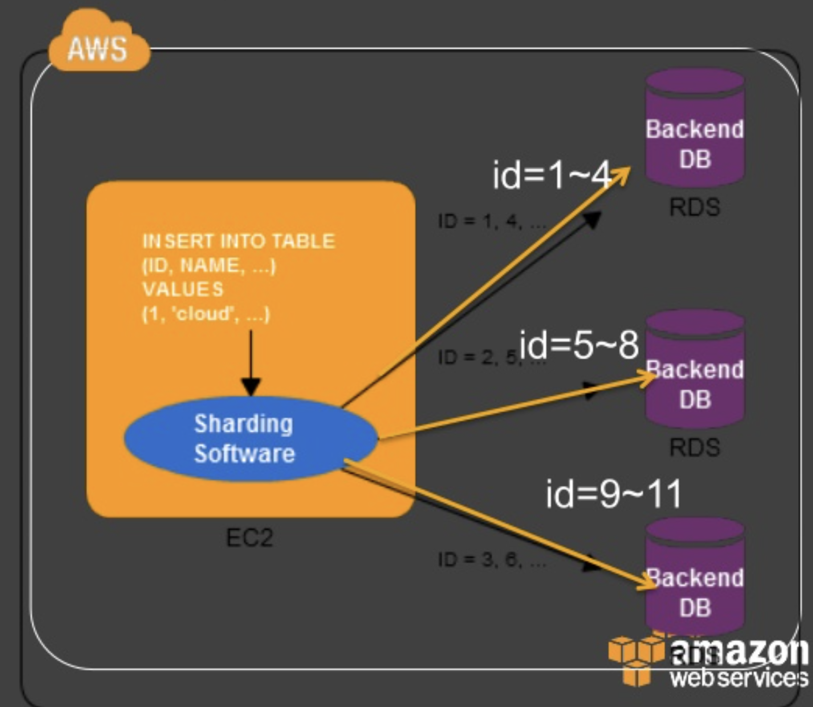

# 개요

서버는 예상 사용자 수 그리고 용도에 따라 서버 설계가 달라집니다.

예를들어 사내에서만 사용하는 서버에 (역시 용도에 따라 다르지만 일반적인 백오피스를 가정합니다) 최대 100만명을 수용하는 scalable 한 서버 설계는 오버엔지니어링이 될 것 입니다.

AWS 에서 낮은 수의 유저부터 최대 5천만명 이상의 트래픽을 커버하는 설계까지 알아보겠습니다.

> 10명만 사용하는 웹사이트에 100만명이 접속가능한 설계는 필요없습니다

# 참고사항

- 이 게시글은 사용자들이 글을 올리고, 보는 커뮤니티 웹사이트를 설계한다고 가정하겠습니다.
- 편의를 위해 DNS, VPC 등 네트워크는 그리지 않습니다.
- 활성 사용자 숫자는 단계를 나타내는 대략적인 수치일 뿐 정확하지 않습니다.
- K는 1,000 을 의미합니다 M 은 1,000,000을 의미합니다

# 트래픽을 고려하지않는 서버 설계 (1~100)

트래픽을 고려하지 않아도 된다면 서버구성은 매우 단순해질 것 입니다

한 인스턴스에서 서버 어플리케이션과 데이터베이스를 모두 띄웁니다.

내부에서 모든것이 이루어집니다. 서버 어플리케이션에서 요청을 받고 디비를 로컬에서 호출하고 결과를 내보냅니다.

# 이제는 확장을 고려할 때 (100~1K)

이제 트래픽에 의한 확장을 고려해야할 때입니다.

서버 확장에는 `수직 확장`, `수평 확장` 두가지 옵션이 있습니다.

이 단계에서는 단순히 서버 사양을 높이는것 (수직 확장) 으로 해결될 수 도 있습니다.

하지만 수직 확장은 이미 올라간 서버의 사양을 바꾸기는 불가능합니다.

항상 일정한 유저가 들어오지 않는다면 수평 확장을 고려해야 합니다

인스턴스를 똑같이 복사하고 Elastic Load Balancer 로 트래픽을 나눠주었습니다.

하지만 이 경우 각각 다른 디비를 가지고있어 데이터 일관성을 해치게됩니다

RDS 에서 DB 를 생성하고 서버에서 각각 같은 DB를 바라보도록 해서 일관성을 가져가게 되었습니다.

서버를 계속해서 무한정 늘리게 된다면 이론상 어플리케이션 단계에서의 병목은 없을 것 입니다

# DB도 느리다 (1K~10K)

이제 서버만 무한정 늘려서 트래픽을 감당할 수 있는 시점은 넘어섰습니다

서버 어플리케이션 100개에서 단 하나의 DB 만을 바라보고있다면 그 DB는 너무나도 불쌍할 것 입니다...

데이터 일관성을 위해 쓰기용 DB는 한개만 두고 읽기용 DB `Read Replica` 를 만들어줍니다.

`Read Replica` 는 쓰기용 DB를 빠르게 복사하여 데이터 동기화를 하는 특징이 있습니다.

AWS Aurora 서비스를 이용한다면 손쉽게 다룰수 있습니다

만약 쓰기용 DB 의 서버가 죽는다면 자동으로 읽기용 DB 가 쓰기용 DB로 승격되는

`Master / Slave` 구조로도 사용됩니다

이제 글쓰기만 감당된다면 DB를 늘리는것으로 어느정도 감당이 될것입니다.

하지만 DB 커넥션은 비싸다는것을 명심해야 합니다.

자주 바뀌지 않는 데이터라면 DB 에 접근하는 대신 메모리 캐시를 이용해서 빠르게 가져올수 있을것입니다.

> 빨간것은 Redis 입니다

먼저 메모리 캐시에 데이터가 있는지 확인 후 데이터가 없다면 DB 를 참고하는 방식으로 쿼리를 줄일 수 있습니다.

기존 데이터가 수정되거나 새롭게 쓸 경우 Redis 에 업데이트하여 데이터의 일관성을 지킬 수 있습니다.

# 컨텐츠는 CDN (10K~100K)

혹시 아직 정적 리소스들을 서버에서 직접 서빙하셨나요? (이미지, 비디오 등)

CDN 은 전 세계로 분포되어있는 Content Delivery Network 입니다.

사이트의 정적 리소스들을 각지에서 빠르게 서빙할 수 있습니다.

AWS 의 cloudfront 를 이용해서 S3 의 컨텐츠들을 서빙합니다.

# 메세지 큐 (100K~1M)

지금까지의 확장은 쓰기 DB를 제외한 서버를 복제하고, 나누고 분산시켰습니다.

하지만 글쓰기만 감당된다면..! 이라는 문제가 아직 남아있었습니다.

쓰기 DB 는 데이터 동기화 문제 때문에 한개만 가지고 있어야 합니다.

그렇기 때문에 동시에 많은 인원이 글쓰기를 한다면 쓰기 DB도 더 이상 버틸 수 없을 것 입니다

이제 메세지 큐를 사용해야 할 때입니다.

메세지 큐는 은행에서의 줄서기와 같습니다. 차례를 기다렸다가 하나씩 처리됩니다.

> SQS 는 AWS 의 메세지 큐 서비스입니다.

서버에서 바로 DB 로 연결하지않고 메세지 큐로 요청을 넘긴다음, Worker 서버가 polling 하며 차례차례 처리합니다. (사용자가 선택한 옵션에 따라 순서를 보장할 수도, 보장하지 않을 수도 있습니다.)

Worker 서버도 마찬가지로 수직, 수평 확장이 가능합니다.

# 아무리 나눠도 DB 가 느리다 (1M~50M)

데이터가 너무 많이 쌓여서 하나의 쿼리만으로도 너무 느려서 도저히 사용할 수 없는 상태가 되었습니다.

샤딩(수평 파티셔닝)을 고려해야 할 때입니다.

샤딩은 한 샤드에 데이터가 몰리지 않도록 기준을 잘 삼아야 합니다

기준을 삼을 때는 두 가지 고려해야 할 것 들이 있습니다.

- 각 샤드의 데이터 용량이 비슷하고 각 샤드에서 비슷한 속도로 데이터가 증가해야합니다
- 각 샤드에 대한 초당 연결 수가 거의 동일하도록 노력해야합니다. 수백만 명의 사용자 중 서비스를 활발히 이용하는 몇천명의 사람들이 트래픽의 10%를 차지할 것 입니다.

> 이미지 출처: aws

잘 쪼개진 DB는 데이터가 분산되었기 때문에 쿼리 퍼포먼스가 증가합니다.

하지만 코드가 복잡해지거나 테이블 join 등 여러 데이터를 동시에 다루기 어렵다는 단점이 존재합니다.

필요한 경우에만 잘 사용해야합니다

# 결론

시스템 확장은 정해진 답이 없습니다.

상황에 따라서 대처해야 하기 때문에 완벽한 아키텍처란 존재하지 않습니다.

일부 데이터를 빠르게 검색하기 위해 NoSQL 데이터베이스에 넣고 더 빠르게 액세스 하거나, 시스템을 자세하게 모니터링하고 성능이 가장 낮은 부분을 미세하게 조정해야 할 수도 있습니다.

확장에 따라 제약이 생기는 부분도 있기 때문에 내가 결정한 시스템에 따라 어떤 부분이 제약되는지 잘 판단하고 결정해야 합니다.
